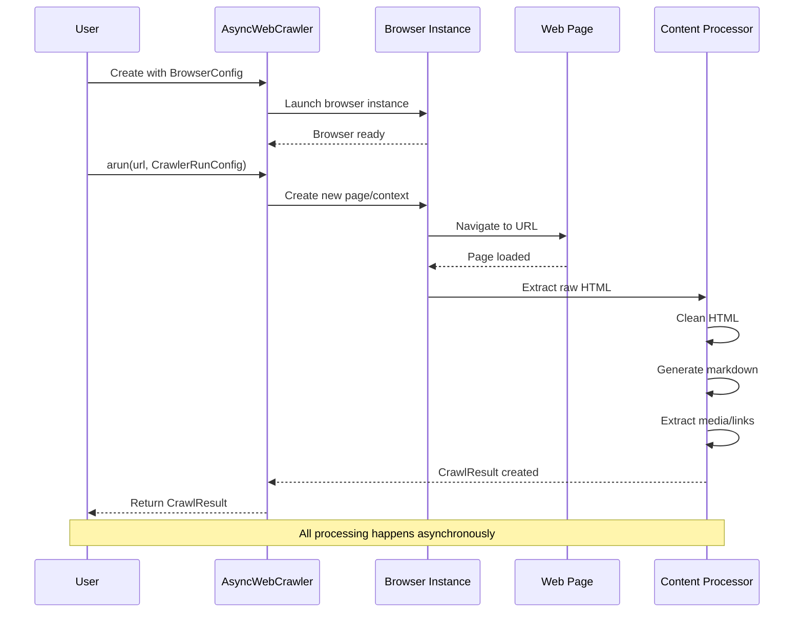
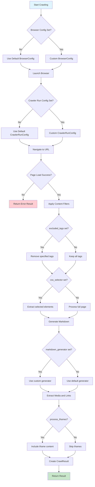
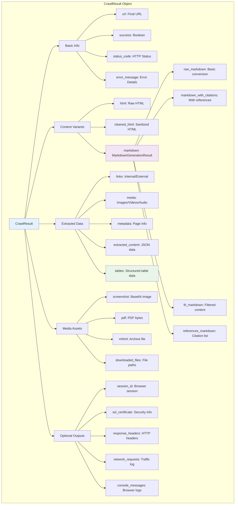
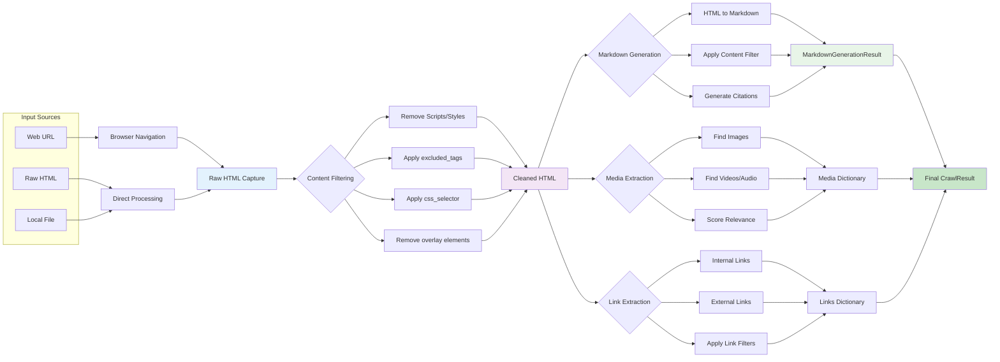
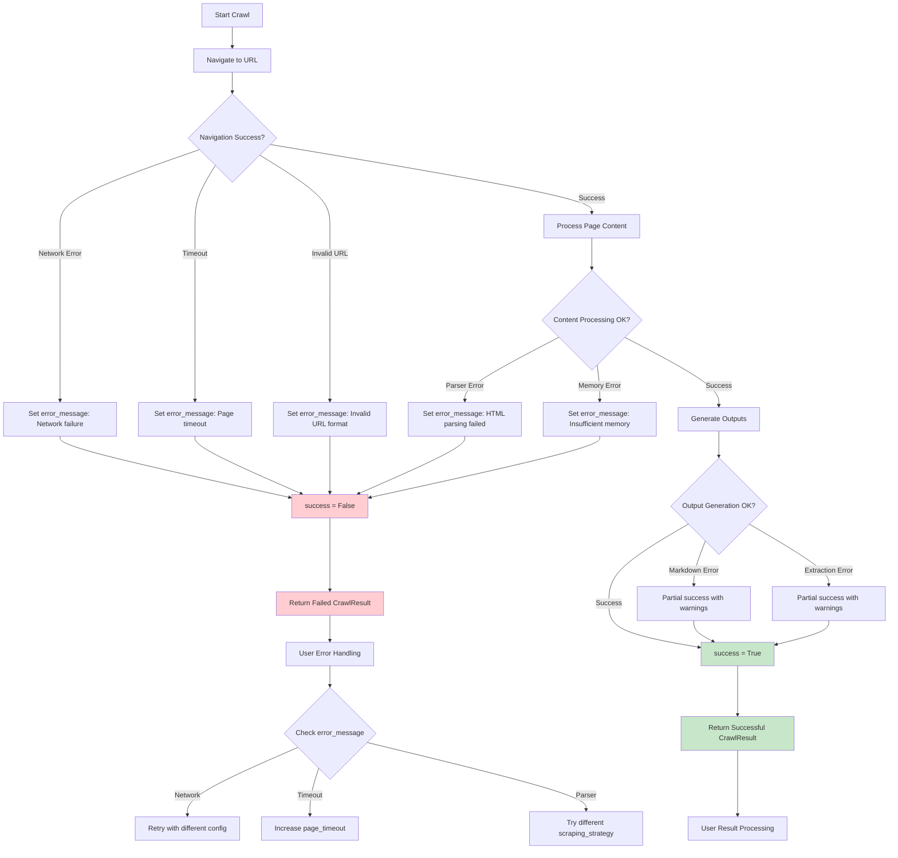
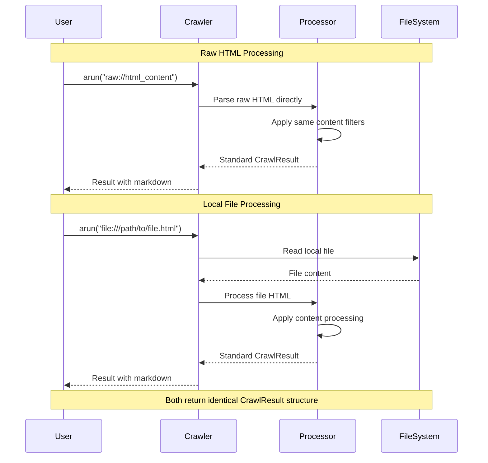
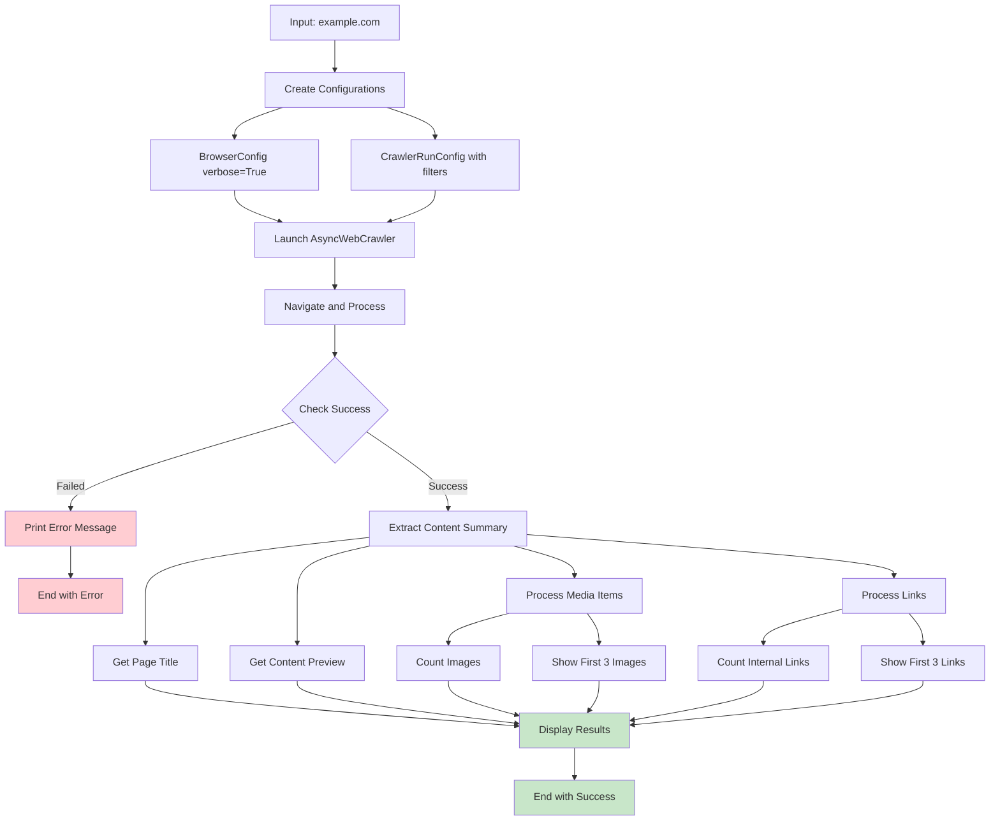

# Crawl4AI Custom LLM Context
Generated on: 2025-12-03T20:19:18.516Z
Total files: 2
Estimated tokens: 5,523

---

## Simple Crawling - Full Content
Component ID: simple_crawling
Context Type: memory
Estimated tokens: 2,390

## Simple Crawling

Basic web crawling operations with AsyncWebCrawler, configurations, and response handling.

### Basic Setup

```python
import asyncio
from crawl4ai import AsyncWebCrawler, BrowserConfig, CrawlerRunConfig

async def main():
    browser_config = BrowserConfig()  # Default browser settings
    run_config = CrawlerRunConfig()   # Default crawl settings

    async with AsyncWebCrawler(config=browser_config) as crawler:
        result = await crawler.arun(
            url="https://example.com",
            config=run_config
        )
        print(result.markdown)

if __name__ == "__main__":
    asyncio.run(main())
```

### Understanding CrawlResult

```python
from crawl4ai.markdown_generation_strategy import DefaultMarkdownGenerator
from crawl4ai.content_filter_strategy import PruningContentFilter

config = CrawlerRunConfig(
    markdown_generator=DefaultMarkdownGenerator(
        content_filter=PruningContentFilter(threshold=0.6),
        options={"ignore_links": True}
    )
)

result = await crawler.arun("https://example.com", config=config)

# Different content formats
print(result.html)                    # Raw HTML
print(result.cleaned_html)            # Cleaned HTML  
print(result.markdown.raw_markdown)   # Raw markdown
print(result.markdown.fit_markdown)   # Filtered markdown

# Status information
print(result.success)      # True/False
print(result.status_code)  # HTTP status (200, 404, etc.)

# Extracted content
print(result.media)        # Images, videos, audio
print(result.links)        # Internal/external links
```

### Basic Configuration Options

```python
run_config = CrawlerRunConfig(
    word_count_threshold=10,        # Min words per block
    exclude_external_links=True,    # Remove external links
    remove_overlay_elements=True,   # Remove popups/modals
    process_iframes=True,           # Process iframe content
    excluded_tags=['form', 'header']  # Skip these tags
)

result = await crawler.arun("https://example.com", config=run_config)
```

### Error Handling

```python
result = await crawler.arun("https://example.com", config=run_config)

if not result.success:
    print(f"Crawl failed: {result.error_message}")
    print(f"Status code: {result.status_code}")
else:
    print(f"Success! Content length: {len(result.markdown)}")
```

### Debugging with Verbose Logging

```python
browser_config = BrowserConfig(verbose=True)

async with AsyncWebCrawler(config=browser_config) as crawler:
    result = await crawler.arun("https://example.com")
    # Detailed logging output will be displayed
```

### Complete Example

```python
import asyncio
from crawl4ai import AsyncWebCrawler, BrowserConfig, CrawlerRunConfig, CacheMode

async def comprehensive_crawl():
    browser_config = BrowserConfig(verbose=True)
    
    run_config = CrawlerRunConfig(
        # Content filtering
        word_count_threshold=10,
        excluded_tags=['form', 'header', 'nav'],
        exclude_external_links=True,
        
        # Content processing
        process_iframes=True,
        remove_overlay_elements=True,
        
        # Cache control
        cache_mode=CacheMode.ENABLED
    )

    async with AsyncWebCrawler(config=browser_config) as crawler:
        result = await crawler.arun(
            url="https://example.com",
            config=run_config
        )
        
        if result.success:
            # Display content summary
            print(f"Title: {result.metadata.get('title', 'No title')}")
            print(f"Content: {result.markdown[:500]}...")
            
            # Process media
            images = result.media.get("images", [])
            print(f"Found {len(images)} images")
            for img in images[:3]:  # First 3 images
                print(f"  - {img.get('src', 'No src')}")
            
            # Process links
            internal_links = result.links.get("internal", [])
            print(f"Found {len(internal_links)} internal links")
            for link in internal_links[:3]:  # First 3 links
                print(f"  - {link.get('href', 'No href')}")
                
        else:
            print(f"❌ Crawl failed: {result.error_message}")
            print(f"Status: {result.status_code}")

if __name__ == "__main__":
    asyncio.run(comprehensive_crawl())
```

### Working with Raw HTML and Local Files

```python
# Crawl raw HTML
raw_html = "<html><body><h1>Test</h1><p>Content</p></body></html>"
result = await crawler.arun(f"raw://{raw_html}")

# Crawl local file
result = await crawler.arun("file:///path/to/local/file.html")

# Both return standard CrawlResult objects
print(result.markdown)
```

## Table Extraction

Extract structured data from HTML tables with automatic detection and scoring.

### Basic Table Extraction

```python
import asyncio
import pandas as pd
from crawl4ai import AsyncWebCrawler, CrawlerRunConfig, CacheMode

async def extract_tables():
    async with AsyncWebCrawler() as crawler:
        config = CrawlerRunConfig(
            table_score_threshold=7,  # Higher = stricter detection
            cache_mode=CacheMode.BYPASS
        )
        
        result = await crawler.arun("https://example.com/tables", config=config)
        
        if result.success and result.tables:
            # New tables field (v0.6+)
            for i, table in enumerate(result.tables):
                print(f"Table {i+1}:")
                print(f"Headers: {table['headers']}")
                print(f"Rows: {len(table['rows'])}")
                print(f"Caption: {table.get('caption', 'No caption')}")
                
                # Convert to DataFrame
                df = pd.DataFrame(table['rows'], columns=table['headers'])
                print(df.head())

asyncio.run(extract_tables())
```

### Advanced Table Processing

```python
from crawl4ai import LXMLWebScrapingStrategy

async def process_financial_tables():
    config = CrawlerRunConfig(
        table_score_threshold=8,  # Strict detection for data tables
        scraping_strategy=LXMLWebScrapingStrategy(),
        keep_data_attributes=True,
        scan_full_page=True
    )
    
    async with AsyncWebCrawler() as crawler:
        result = await crawler.arun("https://coinmarketcap.com", config=config)
        
        if result.tables:
            # Get the main data table (usually first/largest)
            main_table = result.tables[0]
            
            # Create DataFrame
            df = pd.DataFrame(
                main_table['rows'],
                columns=main_table['headers']
            )
            
            # Clean and process data
            df = clean_financial_data(df)
            
            # Save for analysis
            df.to_csv("market_data.csv", index=False)
            return df

def clean_financial_data(df):
    """Clean currency symbols, percentages, and large numbers"""
    for col in df.columns:
        if 'price' in col.lower():
            # Remove currency symbols
            df[col] = df[col].str.replace(r'[^\d.]', '', regex=True)
            df[col] = pd.to_numeric(df[col], errors='coerce')
        
        elif '%' in str(df[col].iloc[0]):
            # Convert percentages
            df[col] = df[col].str.replace('%', '').astype(float) / 100
        
        elif any(suffix in str(df[col].iloc[0]) for suffix in ['B', 'M', 'K']):
            # Handle large numbers (Billions, Millions, etc.)
            df[col] = df[col].apply(convert_large_numbers)
    
    return df

def convert_large_numbers(value):
    """Convert 1.5B -> 1500000000"""
    if pd.isna(value):
        return float('nan')
    
    value = str(value)
    multiplier = 1
    if 'B' in value:
        multiplier = 1e9
    elif 'M' in value:
        multiplier = 1e6
    elif 'K' in value:
        multiplier = 1e3
    
    number = float(re.sub(r'[^\d.]', '', value))
    return number * multiplier
```

### Table Detection Configuration

```python
# Strict table detection (data-heavy pages)
strict_config = CrawlerRunConfig(
    table_score_threshold=9,  # Only high-quality tables
    word_count_threshold=5,   # Ignore sparse content
    excluded_tags=['nav', 'footer']  # Skip navigation tables
)

# Lenient detection (mixed content pages)
lenient_config = CrawlerRunConfig(
    table_score_threshold=5,  # Include layout tables
    process_iframes=True,     # Check embedded tables
    scan_full_page=True      # Scroll to load dynamic tables
)

# Financial/data site optimization
financial_config = CrawlerRunConfig(
    table_score_threshold=8,
    scraping_strategy=LXMLWebScrapingStrategy(),
    wait_for="css:table",     # Wait for tables to load
    scan_full_page=True,
    scroll_delay=0.2
)
```

### Multi-Table Processing

```python
async def extract_all_tables():
    async with AsyncWebCrawler() as crawler:
        result = await crawler.arun("https://example.com/data", config=config)
        
        tables_data = {}
        
        for i, table in enumerate(result.tables):
            # Create meaningful names based on content
            table_name = (
                table.get('caption') or 
                f"table_{i+1}_{table['headers'][0]}"
            ).replace(' ', '_').lower()
            
            df = pd.DataFrame(table['rows'], columns=table['headers'])
            
            # Store with metadata
            tables_data[table_name] = {
                'dataframe': df,
                'headers': table['headers'],
                'row_count': len(table['rows']),
                'caption': table.get('caption'),
                'summary': table.get('summary')
            }
        
        return tables_data

# Usage
tables = await extract_all_tables()
for name, data in tables.items():
    print(f"{name}: {data['row_count']} rows")
    data['dataframe'].to_csv(f"{name}.csv")
```

### Backward Compatibility

```python
# Support both new and old table formats
def get_tables(result):
    # New format (v0.6+)
    if hasattr(result, 'tables') and result.tables:
        return result.tables
    
    # Fallback to media.tables (older versions)
    return result.media.get('tables', [])

# Usage in existing code
result = await crawler.arun(url, config=config)
tables = get_tables(result)

for table in tables:
    df = pd.DataFrame(table['rows'], columns=table['headers'])
    # Process table data...
```

### Table Quality Scoring

```python
# Understanding table_score_threshold values:
# 10: Only perfect data tables (headers + data rows)
# 8-9: High-quality tables (recommended for financial/data sites)
# 6-7: Mixed content tables (news sites, wikis)
# 4-5: Layout tables included (broader detection)
# 1-3: All table-like structures (very permissive)

config = CrawlerRunConfig(
    table_score_threshold=8,  # Balanced detection
    verbose=True  # See scoring details in logs
)
```


**📖 Learn more:** [CrawlResult API Reference](https://docs.crawl4ai.com/api/crawl-result/), [Browser & Crawler Configuration](https://docs.crawl4ai.com/core/browser-crawler-config/), [Cache Modes](https://docs.crawl4ai.com/core/cache-modes/)

---


## Simple Crawling - Diagrams & Workflows
Component ID: simple_crawling
Context Type: reasoning
Estimated tokens: 3,133

## Simple Crawling Workflows and Data Flow

Visual representations of basic web crawling operations, configuration patterns, and result processing workflows.

### Basic Crawling Sequence



### Crawling Configuration Flow



### CrawlResult Data Structure



### Content Processing Pipeline



### Table Extraction Workflow

```mermaid
stateDiagram-v2
    [*] --> DetectTables
    
    DetectTables --> ScoreTables: Find table elements
    
    ScoreTables --> EvaluateThreshold: Calculate quality scores
    EvaluateThreshold --> PassThreshold: score >= table_score_threshold
    EvaluateThreshold --> RejectTable: score < threshold
    
    PassThreshold --> ExtractHeaders: Parse table structure
    ExtractHeaders --> ExtractRows: Get header cells
    ExtractRows --> ExtractMetadata: Get data rows
    ExtractMetadata --> CreateTableObject: Get caption/summary
    
    CreateTableObject --> AddToResult: {headers, rows, caption, summary}
    AddToResult --> [*]: Table extraction complete
    
    RejectTable --> [*]: Table skipped
    
    note right of ScoreTables : Factors: header presence, data density, structure quality
    note right of EvaluateThreshold : Threshold 1-10, higher = stricter
```

### Error Handling Decision Tree



### Configuration Impact Matrix

```mermaid
graph TB
    subgraph "Configuration Categories"
        A[Content Processing]
        B[Page Interaction] 
        C[Output Generation]
        D[Performance]
    end
    
    subgraph "Configuration Options"
        A --> A1[word_count_threshold]
        A --> A2[excluded_tags]
        A --> A3[css_selector]
        A --> A4[exclude_external_links]
        
        B --> B1[process_iframes]
        B --> B2[remove_overlay_elements]
        B --> B3[scan_full_page]
        B --> B4[wait_for]
        
        C --> C1[screenshot]
        C --> C2[pdf] 
        C --> C3[markdown_generator]
        C --> C4[table_score_threshold]
        
        D --> D1[cache_mode]
        D --> D2[verbose]
        D --> D3[page_timeout]
        D --> D4[semaphore_count]
    end
    
    subgraph "Result Impact"
        A1 --> R1[Filters short text blocks]
        A2 --> R2[Removes specified HTML tags]
        A3 --> R3[Focuses on selected content]
        A4 --> R4[Cleans links dictionary]
        
        B1 --> R5[Includes iframe content]
        B2 --> R6[Removes popups/modals]
        B3 --> R7[Loads dynamic content]
        B4 --> R8[Waits for specific elements]
        
        C1 --> R9[Adds screenshot field]
        C2 --> R10[Adds pdf field]
        C3 --> R11[Custom markdown processing]
        C4 --> R12[Filters table quality]
        
        D1 --> R13[Controls caching behavior]
        D2 --> R14[Detailed logging output]
        D3 --> R15[Prevents timeout errors]
        D4 --> R16[Limits concurrent operations]
    end
    
    style A fill:#e3f2fd
    style B fill:#f3e5f5
    style C fill:#e8f5e8
    style D fill:#fff3e0
```



### Raw HTML and Local File Processing



### Comprehensive Processing Example Flow



**📖 Learn more:** [Simple Crawling Guide](https://docs.crawl4ai.com/core/simple-crawling/), [Configuration Options](https://docs.crawl4ai.com/core/browser-crawler-config/), [Result Processing](https://docs.crawl4ai.com/core/crawler-result/), [Table Extraction](https://docs.crawl4ai.com/extraction/no-llm-strategies/)

---

