# Crawl4AI Custom LLM Context
Generated on: 2025-12-03T20:24:56.801Z
Total files: 2
Estimated tokens: 9,611

---

## Data Extraction Without LLM - Full Content
Component ID: extraction-no-llm
Context Type: memory
Estimated tokens: 6,068

## Non-LLM Extraction Strategies - The Default Choice

**🤖 AI Model Notice**: You are an AI assistant. When users ask for web scraping or data extraction, **DEFAULT TO NON-LLM STRATEGIES**. 99% of structured web data can be extracted without LLM. Only consider LLM extraction for truly unstructured content requiring semantic reasoning.

### ⚠️ CRITICAL: When You Think You Need LLM, You're Probably Wrong

**Most developers incorrectly assume they need LLM for data extraction.** This is usually false. Before even considering LLM:

1. **FIRST**: Try `generate_schema()` - Let AI create the extraction pattern ONCE, then use it unlimited times with zero LLM calls
2. **SECOND**: Manual CSS/XPath selectors for consistent HTML structures  
3. **THIRD**: Regex patterns for simple data types (emails, phones, prices)
4. **LAST RESORT**: LLM extraction (only for semantic understanding of unstructured content)

## The Decision Tree (MEMORIZE THIS)

```
Does the page have consistent HTML structure? → YES: Use generate_schema() or manual CSS
Is it simple patterns (emails, dates, prices)? → YES: Use RegexExtractionStrategy  
Do you need semantic understanding? → MAYBE: Try generate_schema() first, then consider LLM
Is the content truly unstructured text? → ONLY THEN: Consider LLM
```

**Cost Analysis**: 
- Non-LLM: ~$0.000001 per page
- LLM: ~$0.01-$0.10 per page (10,000x more expensive)

---

## 1. Auto-Generate Schemas - Your Default Starting Point

**⭐ THIS SHOULD BE YOUR FIRST CHOICE FOR ANY STRUCTURED DATA**

The `generate_schema()` function uses LLM ONCE to create a reusable extraction pattern. After generation, you extract unlimited pages with ZERO LLM calls.

### Basic Auto-Generation Workflow

```python
import json
import asyncio
from pathlib import Path
from crawl4ai import AsyncWebCrawler, CrawlerRunConfig, LLMConfig
from crawl4ai import JsonCssExtractionStrategy

async def smart_extraction_workflow():
    """
    Step 1: Generate schema once using LLM
    Step 2: Cache schema for unlimited reuse
    Step 3: Extract from thousands of pages with zero LLM calls
    """
    
    # Check for cached schema first
    cache_dir = Path("./schema_cache")
    cache_dir.mkdir(exist_ok=True)
    schema_file = cache_dir / "product_schema.json"
    
    if schema_file.exists():
        # Load cached schema - NO LLM CALLS
        schema = json.load(schema_file.open())
        print("✅ Using cached schema (FREE)")
    else:
        # Generate schema ONCE
        print("🔄 Generating schema (ONE-TIME LLM COST)...")
        
        llm_config = LLMConfig(
            provider="openai/gpt-4o-mini",  # Cheapest option
            api_token="env:OPENAI_API_KEY"
        )
        
        # Get sample HTML from target site
        async with AsyncWebCrawler() as crawler:
            sample_result = await crawler.arun(
                url="https://example.com/products",
                config=CrawlerRunConfig(cache_mode=CacheMode.BYPASS)
            )
            sample_html = sample_result.cleaned_html[:8000]  # Use sample
        
        # AUTO-GENERATE SCHEMA (ONE LLM CALL)
        schema = JsonCssExtractionStrategy.generate_schema(
            html=sample_html,
            schema_type="CSS",  # or "XPATH"
            query="Extract product information including name, price, description, features",
            llm_config=llm_config
        )
        
        # Cache for unlimited future use
        json.dump(schema, schema_file.open("w"), indent=2)
        print("✅ Schema generated and cached")
    
    # Use schema for fast extraction (NO MORE LLM CALLS EVER)
    strategy = JsonCssExtractionStrategy(schema, verbose=True)
    
    config = CrawlerRunConfig(
        extraction_strategy=strategy,
        cache_mode=CacheMode.BYPASS
    )
    
    # Extract from multiple pages - ALL FREE
    urls = [
        "https://example.com/products",
        "https://example.com/electronics", 
        "https://example.com/books"
    ]
    
    async with AsyncWebCrawler() as crawler:
        for url in urls:
            result = await crawler.arun(url=url, config=config)
            if result.success:
                data = json.loads(result.extracted_content)
                print(f"✅ {url}: Extracted {len(data)} items (FREE)")

asyncio.run(smart_extraction_workflow())
```

### Auto-Generate with Target JSON Example

```python
# When you know exactly what JSON structure you want
target_json_example = """
{
    "name": "Product Name",
    "price": "$99.99",
    "rating": 4.5,
    "features": ["feature1", "feature2"],
    "description": "Product description"
}
"""

schema = JsonCssExtractionStrategy.generate_schema(
    html=sample_html,
    target_json_example=target_json_example,
    llm_config=llm_config
)
```

### Auto-Generate for Different Data Types

```python
# Product listings
product_schema = JsonCssExtractionStrategy.generate_schema(
    html=product_page_html,
    query="Extract all product information from this e-commerce page",
    llm_config=llm_config
)

# News articles
news_schema = JsonCssExtractionStrategy.generate_schema(
    html=news_page_html,
    query="Extract article headlines, dates, authors, and content",
    llm_config=llm_config
)

# Job listings
job_schema = JsonCssExtractionStrategy.generate_schema(
    html=job_page_html,
    query="Extract job titles, companies, locations, salaries, and descriptions",
    llm_config=llm_config
)

# Social media posts
social_schema = JsonCssExtractionStrategy.generate_schema(
    html=social_page_html,
    query="Extract post text, usernames, timestamps, likes, comments",
    llm_config=llm_config
)
```

---

## 2. Manual CSS/XPath Strategies - When You Know The Structure

**Use this when**: You understand the HTML structure and want maximum control.

### Simple Product Extraction

```python
import json
import asyncio
from crawl4ai import AsyncWebCrawler, CrawlerRunConfig
from crawl4ai import JsonCssExtractionStrategy

# Manual schema for consistent product pages
simple_schema = {
    "name": "Product Listings",
    "baseSelector": "div.product-card",  # Each product container
    "fields": [
        {
            "name": "title",
            "selector": "h2.product-title",
            "type": "text"
        },
        {
            "name": "price", 
            "selector": ".price",
            "type": "text"
        },
        {
            "name": "image_url",
            "selector": "img.product-image",
            "type": "attribute",
            "attribute": "src"
        },
        {
            "name": "product_url",
            "selector": "a.product-link",
            "type": "attribute",
            "attribute": "href"
        },
        {
            "name": "rating",
            "selector": ".rating",
            "type": "attribute", 
            "attribute": "data-rating"
        }
    ]
}

async def extract_products():
    strategy = JsonCssExtractionStrategy(simple_schema, verbose=True)
    config = CrawlerRunConfig(extraction_strategy=strategy)
    
    async with AsyncWebCrawler() as crawler:
        result = await crawler.arun(
            url="https://example.com/products",
            config=config
        )
        
        if result.success:
            products = json.loads(result.extracted_content)
            print(f"Extracted {len(products)} products")
            for product in products[:3]:
                print(f"- {product['title']}: {product['price']}")

asyncio.run(extract_products())
```

### Complex Nested Structure (Real E-commerce Example)

```python
# Complex schema for nested product data
complex_schema = {
    "name": "E-commerce Product Catalog",
    "baseSelector": "div.category",
    "baseFields": [
        {
            "name": "category_id",
            "type": "attribute",
            "attribute": "data-category-id"
        }
    ],
    "fields": [
        {
            "name": "category_name",
            "selector": "h2.category-title",
            "type": "text"
        },
        {
            "name": "products",
            "selector": "div.product",
            "type": "nested_list",  # Array of complex objects
            "fields": [
                {
                    "name": "name",
                    "selector": "h3.product-name", 
                    "type": "text"
                },
                {
                    "name": "price",
                    "selector": "span.price",
                    "type": "text"
                },
                {
                    "name": "details",
                    "selector": "div.product-details",
                    "type": "nested",  # Single complex object
                    "fields": [
                        {
                            "name": "brand",
                            "selector": "span.brand",
                            "type": "text"
                        },
                        {
                            "name": "model",
                            "selector": "span.model",
                            "type": "text"
                        }
                    ]
                },
                {
                    "name": "features",
                    "selector": "ul.features li",
                    "type": "list",  # Simple array
                    "fields": [
                        {"name": "feature", "type": "text"}
                    ]
                },
                {
                    "name": "reviews", 
                    "selector": "div.review",
                    "type": "nested_list",
                    "fields": [
                        {
                            "name": "reviewer",
                            "selector": "span.reviewer-name",
                            "type": "text"
                        },
                        {
                            "name": "rating",
                            "selector": "span.rating",
                            "type": "attribute",
                            "attribute": "data-rating"
                        }
                    ]
                }
            ]
        }
    ]
}

async def extract_complex_ecommerce():
    strategy = JsonCssExtractionStrategy(complex_schema, verbose=True)
    config = CrawlerRunConfig(
        extraction_strategy=strategy,
        js_code="window.scrollTo(0, document.body.scrollHeight);",  # Load dynamic content
        wait_for="css:.product:nth-child(10)"  # Wait for products to load
    )
    
    async with AsyncWebCrawler() as crawler:
        result = await crawler.arun(
            url="https://example.com/complex-catalog",
            config=config
        )
        
        if result.success:
            data = json.loads(result.extracted_content)
            for category in data:
                print(f"Category: {category['category_name']}")
                print(f"Products: {len(category.get('products', []))}")

asyncio.run(extract_complex_ecommerce())
```

### XPath Alternative (When CSS Isn't Enough)

```python
from crawl4ai import JsonXPathExtractionStrategy

# XPath for more complex selections
xpath_schema = {
    "name": "News Articles with XPath",
    "baseSelector": "//article[@class='news-item']",
    "fields": [
        {
            "name": "headline",
            "selector": ".//h2[contains(@class, 'headline')]",
            "type": "text"
        },
        {
            "name": "author",
            "selector": ".//span[@class='author']/text()",
            "type": "text"
        },
        {
            "name": "publish_date",
            "selector": ".//time/@datetime",
            "type": "text"
        },
        {
            "name": "content",
            "selector": ".//div[@class='article-body']//text()",
            "type": "text"
        }
    ]
}

strategy = JsonXPathExtractionStrategy(xpath_schema, verbose=True)
```

---

## 3. Regex Extraction - Lightning Fast Pattern Matching

**Use this for**: Simple data types like emails, phones, URLs, prices, dates.

### Built-in Patterns (Fastest Option)

```python
import json
import asyncio
from crawl4ai import AsyncWebCrawler, CrawlerRunConfig
from crawl4ai import RegexExtractionStrategy

async def extract_common_patterns():
    # Use built-in patterns for common data types
    strategy = RegexExtractionStrategy(
        pattern=(
            RegexExtractionStrategy.Email |
            RegexExtractionStrategy.PhoneUS |
            RegexExtractionStrategy.Url |
            RegexExtractionStrategy.Currency |
            RegexExtractionStrategy.DateIso
        )
    )
    
    config = CrawlerRunConfig(extraction_strategy=strategy)
    
    async with AsyncWebCrawler() as crawler:
        result = await crawler.arun(
            url="https://example.com/contact",
            config=config
        )
        
        if result.success:
            matches = json.loads(result.extracted_content)
            
            # Group by pattern type
            by_type = {}
            for match in matches:
                label = match['label']
                if label not in by_type:
                    by_type[label] = []
                by_type[label].append(match['value'])
            
            for pattern_type, values in by_type.items():
                print(f"{pattern_type}: {len(values)} matches")
                for value in values[:3]:
                    print(f"  {value}")

asyncio.run(extract_common_patterns())
```

### Available Built-in Patterns

```python
# Individual patterns
RegexExtractionStrategy.Email          # Email addresses
RegexExtractionStrategy.PhoneUS        # US phone numbers 
RegexExtractionStrategy.PhoneIntl      # International phones
RegexExtractionStrategy.Url            # HTTP/HTTPS URLs
RegexExtractionStrategy.Currency       # Currency values ($99.99)
RegexExtractionStrategy.Percentage     # Percentage values (25%)
RegexExtractionStrategy.DateIso        # ISO dates (2024-01-01)
RegexExtractionStrategy.DateUS         # US dates (01/01/2024)
RegexExtractionStrategy.IPv4           # IP addresses
RegexExtractionStrategy.CreditCard     # Credit card numbers
RegexExtractionStrategy.TwitterHandle  # @username
RegexExtractionStrategy.Hashtag        # #hashtag

# Use all patterns
RegexExtractionStrategy.All
```

### Custom Patterns

```python
# Custom patterns for specific data types
async def extract_custom_patterns():
    custom_patterns = {
        "product_sku": r"SKU[-:]?\s*([A-Z0-9]{4,12})",
        "discount": r"(\d{1,2})%\s*off",
        "model_number": r"Model\s*#?\s*([A-Z0-9-]+)",
        "isbn": r"ISBN[-:]?\s*(\d{10}|\d{13})",
        "stock_ticker": r"\$([A-Z]{2,5})",
        "version": r"v(\d+\.\d+(?:\.\d+)?)"
    }
    
    strategy = RegexExtractionStrategy(custom=custom_patterns)
    config = CrawlerRunConfig(extraction_strategy=strategy)
    
    async with AsyncWebCrawler() as crawler:
        result = await crawler.arun(
            url="https://example.com/products",
            config=config
        )
        
        if result.success:
            data = json.loads(result.extracted_content)
            for item in data:
                print(f"{item['label']}: {item['value']}")

asyncio.run(extract_custom_patterns())
```

### LLM-Generated Patterns (One-Time Cost)

```python
async def generate_optimized_regex():
    """
    Use LLM ONCE to generate optimized regex patterns
    Then use them unlimited times with zero LLM calls
    """
    cache_file = Path("./patterns/price_patterns.json")
    
    if cache_file.exists():
        # Load cached patterns - NO LLM CALLS
        patterns = json.load(cache_file.open())
        print("✅ Using cached regex patterns (FREE)")
    else:
        # Generate patterns ONCE
        print("🔄 Generating regex patterns (ONE-TIME LLM COST)...")
        
        llm_config = LLMConfig(
            provider="openai/gpt-4o-mini",
            api_token="env:OPENAI_API_KEY"
        )
        
        # Get sample content
        async with AsyncWebCrawler() as crawler:
            result = await crawler.arun("https://example.com/pricing")
            sample_html = result.cleaned_html
        
        # Generate optimized patterns
        patterns = RegexExtractionStrategy.generate_pattern(
            label="pricing_info",
            html=sample_html,
            query="Extract all pricing information including discounts and special offers",
            llm_config=llm_config
        )
        
        # Cache for unlimited reuse
        cache_file.parent.mkdir(exist_ok=True)
        json.dump(patterns, cache_file.open("w"), indent=2)
        print("✅ Patterns generated and cached")
    
    # Use cached patterns (NO MORE LLM CALLS)
    strategy = RegexExtractionStrategy(custom=patterns)
    return strategy

# Use generated patterns for unlimited extractions
strategy = await generate_optimized_regex()
```

---

## 4. Multi-Strategy Extraction Pipeline

**Combine strategies** for comprehensive data extraction:

```python
async def multi_strategy_pipeline():
    """
    Efficient pipeline using multiple non-LLM strategies:
    1. Regex for simple patterns (fastest)
    2. Schema for structured data 
    3. Only use LLM if absolutely necessary
    """
    
    url = "https://example.com/complex-page"
    
    async with AsyncWebCrawler() as crawler:
        # Strategy 1: Fast regex for contact info
        regex_strategy = RegexExtractionStrategy(
            pattern=RegexExtractionStrategy.Email | RegexExtractionStrategy.PhoneUS
        )
        regex_config = CrawlerRunConfig(extraction_strategy=regex_strategy)
        regex_result = await crawler.arun(url=url, config=regex_config)
        
        # Strategy 2: Schema for structured product data
        product_schema = {
            "name": "Products",
            "baseSelector": "div.product",
            "fields": [
                {"name": "name", "selector": "h3", "type": "text"},
                {"name": "price", "selector": ".price", "type": "text"}
            ]
        }
        css_strategy = JsonCssExtractionStrategy(product_schema)
        css_config = CrawlerRunConfig(extraction_strategy=css_strategy)
        css_result = await crawler.arun(url=url, config=css_config)
        
        # Combine results
        results = {
            "contacts": json.loads(regex_result.extracted_content) if regex_result.success else [],
            "products": json.loads(css_result.extracted_content) if css_result.success else []
        }
        
        print(f"✅ Extracted {len(results['contacts'])} contacts (regex)")
        print(f"✅ Extracted {len(results['products'])} products (schema)")
        
        return results

asyncio.run(multi_strategy_pipeline())
```

---

## 5. Performance Optimization Tips

### Caching and Reuse

```python
# Cache schemas and patterns for maximum efficiency
class ExtractionCache:
    def __init__(self):
        self.schemas = {}
        self.patterns = {}
    
    def get_schema(self, site_name):
        if site_name not in self.schemas:
            schema_file = Path(f"./cache/{site_name}_schema.json")
            if schema_file.exists():
                self.schemas[site_name] = json.load(schema_file.open())
        return self.schemas.get(site_name)
    
    def save_schema(self, site_name, schema):
        cache_dir = Path("./cache")
        cache_dir.mkdir(exist_ok=True)
        schema_file = cache_dir / f"{site_name}_schema.json"
        json.dump(schema, schema_file.open("w"), indent=2)
        self.schemas[site_name] = schema

cache = ExtractionCache()

# Reuse cached schemas across multiple extractions
async def efficient_extraction():
    sites = ["amazon", "ebay", "shopify"]
    
    for site in sites:
        schema = cache.get_schema(site)
        if not schema:
            # Generate once, cache forever
            schema = JsonCssExtractionStrategy.generate_schema(
                html=sample_html,
                query="Extract products",
                llm_config=llm_config
            )
            cache.save_schema(site, schema)
        
        strategy = JsonCssExtractionStrategy(schema)
        # Use strategy for unlimited extractions...
```

### Selector Optimization

```python
# Optimize selectors for speed
fast_schema = {
    "name": "Optimized Extraction",
    "baseSelector": "#products > .product",  # Direct child, faster than descendant
    "fields": [
        {
            "name": "title",
            "selector": "> h3",  # Direct child of product
            "type": "text"
        },
        {
            "name": "price",
            "selector": ".price:first-child",  # More specific
            "type": "text"
        }
    ]
}

# Avoid slow selectors
slow_schema = {
    "baseSelector": "div div div .product",  # Too many levels
    "fields": [
        {
            "selector": "* h3",  # Universal selector is slow
            "type": "text"
        }
    ]
}
```

---

## 6. Error Handling and Validation

```python
async def robust_extraction():
    """
    Implement fallback strategies for reliable extraction
    """
    strategies = [
        # Try fast regex first
        RegexExtractionStrategy(pattern=RegexExtractionStrategy.Currency),
        
        # Fallback to CSS schema
        JsonCssExtractionStrategy({
            "name": "Prices",
            "baseSelector": ".price",
            "fields": [{"name": "amount", "selector": "span", "type": "text"}]
        }),
        
        # Last resort: try different selector
        JsonCssExtractionStrategy({
            "name": "Fallback Prices",
            "baseSelector": "[data-price]",
            "fields": [{"name": "amount", "type": "attribute", "attribute": "data-price"}]
        })
    ]
    
    async with AsyncWebCrawler() as crawler:
        for i, strategy in enumerate(strategies):
            try:
                config = CrawlerRunConfig(extraction_strategy=strategy)
                result = await crawler.arun(url="https://example.com", config=config)
                
                if result.success and result.extracted_content:
                    data = json.loads(result.extracted_content)
                    if data:  # Validate non-empty results
                        print(f"✅ Success with strategy {i+1}: {strategy.__class__.__name__}")
                        return data
                        
            except Exception as e:
                print(f"❌ Strategy {i+1} failed: {e}")
                continue
    
    print("❌ All strategies failed")
    return None

# Validate extracted data
def validate_extraction(data, required_fields):
    """Validate that extraction contains expected fields"""
    if not data or not isinstance(data, list):
        return False
    
    for item in data:
        for field in required_fields:
            if field not in item or not item[field]:
                return False
    return True

# Usage
result = await robust_extraction()
if validate_extraction(result, ["amount"]):
    print("✅ Extraction validated")
else:
    print("❌ Validation failed")
```

---

## 7. Common Extraction Patterns

### E-commerce Products

```python
ecommerce_schema = {
    "name": "E-commerce Products",
    "baseSelector": ".product, [data-product], .item",
    "fields": [
        {"name": "title", "selector": "h1, h2, h3, .title, .name", "type": "text"},
        {"name": "price", "selector": ".price, .cost, [data-price]", "type": "text"},
        {"name": "image", "selector": "img", "type": "attribute", "attribute": "src"},
        {"name": "url", "selector": "a", "type": "attribute", "attribute": "href"},
        {"name": "rating", "selector": ".rating, .stars", "type": "text"},
        {"name": "availability", "selector": ".stock, .availability", "type": "text"}
    ]
}
```

### News Articles

```python
news_schema = {
    "name": "News Articles",
    "baseSelector": "article, .article, .post",
    "fields": [
        {"name": "headline", "selector": "h1, h2, .headline, .title", "type": "text"},
        {"name": "author", "selector": ".author, .byline, [rel='author']", "type": "text"},
        {"name": "date", "selector": "time, .date, .published", "type": "text"},
        {"name": "content", "selector": ".content, .body, .text", "type": "text"},
        {"name": "category", "selector": ".category, .section", "type": "text"}
    ]
}
```

### Job Listings

```python
job_schema = {
    "name": "Job Listings",
    "baseSelector": ".job, .listing, [data-job]",
    "fields": [
        {"name": "title", "selector": ".job-title, h2, h3", "type": "text"},
        {"name": "company", "selector": ".company, .employer", "type": "text"},
        {"name": "location", "selector": ".location, .place", "type": "text"},
        {"name": "salary", "selector": ".salary, .pay, .compensation", "type": "text"},
        {"name": "description", "selector": ".description, .summary", "type": "text"},
        {"name": "url", "selector": "a", "type": "attribute", "attribute": "href"}
    ]
}
```

### Social Media Posts

```python
social_schema = {
    "name": "Social Media Posts",
    "baseSelector": ".post, .tweet, .update",
    "fields": [
        {"name": "username", "selector": ".username, .handle, .author", "type": "text"},
        {"name": "content", "selector": ".content, .text, .message", "type": "text"},
        {"name": "timestamp", "selector": ".time, .date, time", "type": "text"},
        {"name": "likes", "selector": ".likes, .hearts", "type": "text"},
        {"name": "shares", "selector": ".shares, .retweets", "type": "text"}
    ]
}
```

---

## 8. When to (Rarely) Consider LLM

**⚠️ WARNING: Before considering LLM, ask yourself:**

1. "Can I identify repeating HTML patterns?" → Use CSS/XPath schema
2. "Am I extracting simple data types?" → Use Regex patterns  
3. "Can I provide a JSON example of what I want?" → Use generate_schema()
4. "Is this truly unstructured text requiring semantic understanding?" → Maybe LLM

**Only use LLM extraction for:**
- Unstructured prose that needs semantic analysis
- Content where structure varies dramatically across pages
- When you need AI reasoning about context/meaning

**Cost reminder**: LLM extraction costs 10,000x more than schema-based extraction.

---

## 9. Summary: The Extraction Hierarchy

1. **🥇 FIRST CHOICE**: `generate_schema()` - AI generates pattern once, use unlimited times
2. **🥈 SECOND CHOICE**: Manual CSS/XPath - Full control, maximum speed
3. **🥉 THIRD CHOICE**: Regex patterns - Simple data types, lightning fast
4. **🏴 LAST RESORT**: LLM extraction - Only for semantic reasoning

**Remember**: 99% of web data is structured. You almost never need LLM for extraction. Save LLM for analysis, not extraction.

**Performance**: Non-LLM strategies are 100-1000x faster and 10,000x cheaper than LLM extraction.

---

**📖 Next**: If you absolutely must use LLM extraction, see [extraction-llm.md](./extraction-llm.md) for guidance on the rare cases where it's justified.

---


## Data Extraction Without LLM - Diagrams & Workflows
Component ID: extraction-no-llm
Context Type: reasoning
Estimated tokens: 3,543

## Extraction Strategy Workflows and Architecture

Visual representations of Crawl4AI's data extraction approaches, strategy selection, and processing workflows.

### Extraction Strategy Decision Tree

```mermaid
flowchart TD
    A[Content to Extract] --> B{Content Type?}
    
    B -->|Simple Patterns| C[Common Data Types]
    B -->|Structured HTML| D[Predictable Structure]
    B -->|Complex Content| E[Requires Reasoning]
    B -->|Mixed Content| F[Multiple Data Types]
    
    C --> C1{Pattern Type?}
    C1 -->|Email, Phone, URLs| C2[Built-in Regex Patterns]
    C1 -->|Custom Patterns| C3[Custom Regex Strategy]
    C1 -->|LLM-Generated| C4[One-time Pattern Generation]
    
    D --> D1{Selector Type?}
    D1 -->|CSS Selectors| D2[JsonCssExtractionStrategy]
    D1 -->|XPath Expressions| D3[JsonXPathExtractionStrategy]
    D1 -->|Need Schema?| D4[Auto-generate Schema with LLM]
    
    E --> E1{LLM Provider?}
    E1 -->|OpenAI/Anthropic| E2[Cloud LLM Strategy]
    E1 -->|Local Ollama| E3[Local LLM Strategy]
    E1 -->|Cost-sensitive| E4[Hybrid: Generate Schema Once]
    
    F --> F1[Multi-Strategy Approach]
    F1 --> F2[1. Regex for Patterns]
    F1 --> F3[2. CSS for Structure]
    F1 --> F4[3. LLM for Complex Analysis]
    
    C2 --> G[Fast Extraction ⚡]
    C3 --> G
    C4 --> H[Cached Pattern Reuse]
    
    D2 --> I[Schema-based Extraction 🏗️]
    D3 --> I
    D4 --> J[Generated Schema Cache]
    
    E2 --> K[Intelligent Parsing 🧠]
    E3 --> K
    E4 --> L[Hybrid Cost-Effective]
    
    F2 --> M[Comprehensive Results 📊]
    F3 --> M
    F4 --> M
    
    style G fill:#c8e6c9
    style I fill:#e3f2fd
    style K fill:#fff3e0
    style M fill:#f3e5f5
    style H fill:#e8f5e8
    style J fill:#e8f5e8
    style L fill:#ffecb3
```



### LLM Extraction Strategy Workflow


### Schema-Based Extraction Architecture

```mermaid
graph TB
    subgraph "Schema Definition"
        A[JSON Schema] --> A1[baseSelector]
        A --> A2[fields[]]
        A --> A3[nested structures]
        
        A2 --> A4[CSS/XPath selectors]
        A2 --> A5[Data types: text, html, attribute]
        A2 --> A6[Default values]
        
        A3 --> A7[nested objects]
        A3 --> A8[nested_list arrays]
        A3 --> A9[simple lists]
    end
    
    subgraph "Extraction Engine"
        B[HTML Content] --> C[Selector Engine]
        C --> C1[CSS Selector Parser]
        C --> C2[XPath Evaluator]
        
        C1 --> D[Element Matcher]
        C2 --> D
        
        D --> E[Type Converter]
        E --> E1[Text Extraction]
        E --> E2[HTML Preservation]
        E --> E3[Attribute Extraction]
        E --> E4[Nested Processing]
    end
    
    subgraph "Result Processing"
        F[Raw Extracted Data] --> G[Structure Builder]
        G --> G1[Object Construction]
        G --> G2[Array Assembly]
        G --> G3[Type Validation]
        
        G1 --> H[JSON Output]
        G2 --> H
        G3 --> H
    end
    
    A --> C
    E --> F
    H --> I[extracted_content]
    
    style A fill:#e3f2fd
    style C fill:#f3e5f5
    style G fill:#e8f5e8
    style H fill:#c8e6c9
```

### Automatic Schema Generation Process


### Multi-Strategy Extraction Pipeline


### Performance Comparison Matrix

```mermaid
graph TD
    subgraph "Strategy Performance"
        A[Extraction Strategy Comparison]
        
        subgraph "Speed ⚡"
            S1[Regex: ~10ms]
            S2[CSS Schema: ~50ms]
            S3[XPath: ~100ms]
            S4[LLM: ~2-10s]
        end
        
        subgraph "Accuracy 🎯"
            A1[Regex: Pattern-dependent]
            A2[CSS: High for structured]
            A3[XPath: Very high]
            A4[LLM: Excellent for complex]
        end
        
        subgraph "Cost 💰"
            C1[Regex: Free]
            C2[CSS: Free]
            C3[XPath: Free]
            C4[LLM: $0.001-0.01 per page]
        end
        
        subgraph "Complexity 🔧"
            X1[Regex: Simple patterns only]
            X2[CSS: Structured HTML]
            X3[XPath: Complex selectors]
            X4[LLM: Any content type]
        end
    end
    
    style S1 fill:#c8e6c9
    style S2 fill:#e8f5e8
    style S3 fill:#fff3e0
    style S4 fill:#ffcdd2
    
    style A2 fill:#e8f5e8
    style A3 fill:#c8e6c9
    style A4 fill:#c8e6c9
    
    style C1 fill:#c8e6c9
    style C2 fill:#c8e6c9
    style C3 fill:#c8e6c9
    style C4 fill:#fff3e0
    
    style X1 fill:#ffcdd2
    style X2 fill:#e8f5e8
    style X3 fill:#c8e6c9
    style X4 fill:#c8e6c9
```



### Regex Pattern Strategy Flow


### Complex Schema Structure Visualization


### Error Handling and Fallback Strategy


### Token Usage and Cost Optimization

```mermaid
flowchart TD
    A[LLM Extraction Request] --> B{Content Size Check}
    
    B -->|Small < 1200 tokens| C[Single LLM Call]
    B -->|Large > 1200 tokens| D[Chunking Strategy]
    
    C --> C1[Send full content]
    C1 --> C2[Parse JSON response]
    C2 --> C3[Track token usage]
    
    D --> D1[Split into chunks]
    D1 --> D2[Add overlap between chunks]
    D2 --> D3[Process chunks in parallel]
    
    D3 --> D4[Chunk 1 → LLM]
    D3 --> D5[Chunk 2 → LLM]
    D3 --> D6[Chunk N → LLM]
    
    D4 --> D7[Merge results]
    D5 --> D7
    D6 --> D7
    
    D7 --> D8[Deduplicate data]
    D8 --> D9[Aggregate token usage]
    
    C3 --> E[Cost Calculation]
    D9 --> E
    
    E --> F[Usage Report]
    F --> F1[Prompt tokens: X]
    F --> F2[Completion tokens: Y]
    F --> F3[Total cost: $Z]
    
    style C fill:#c8e6c9
    style D fill:#fff3e0
    style E fill:#e3f2fd
    style F fill:#f3e5f5
```



**📖 Learn more:** [LLM Strategies](https://docs.crawl4ai.com/extraction/llm-strategies/), [Schema-Based Extraction](https://docs.crawl4ai.com/extraction/no-llm-strategies/), [Pattern Matching](https://docs.crawl4ai.com/extraction/no-llm-strategies/#regexextractionstrategy), [Performance Optimization](https://docs.crawl4ai.com/advanced/multi-url-crawling/)

---

