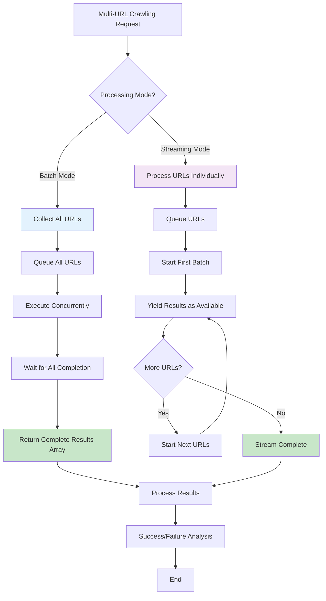
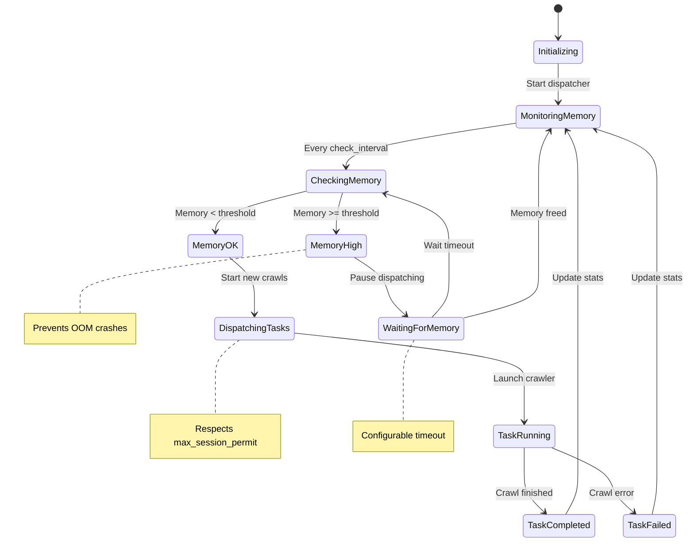
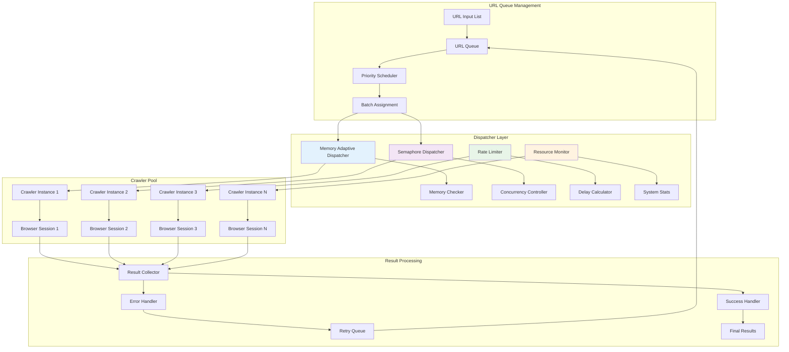
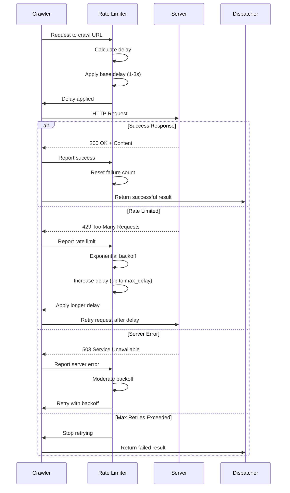
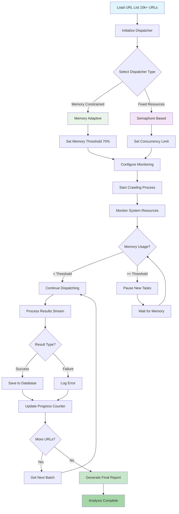
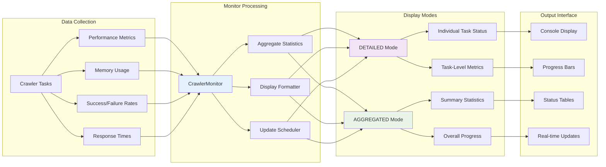
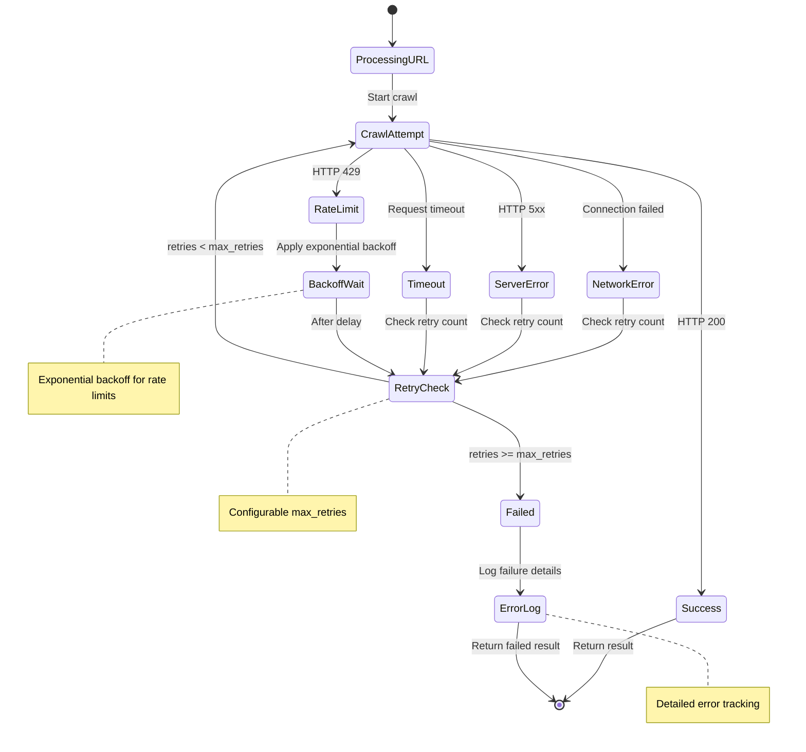
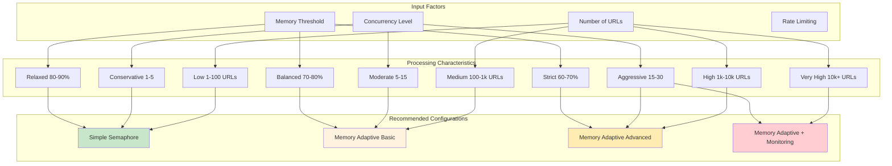

# Crawl4AI Custom LLM Context
Generated on: 2025-12-03T20:26:00.616Z
Total files: 2
Estimated tokens: 5,083

---

## Multi URLs Crawling - Full Content
Component ID: multi_urls_crawling
Context Type: memory
Estimated tokens: 2,230

## Multi-URL Crawling

Concurrent crawling of multiple URLs with intelligent resource management, rate limiting, and real-time monitoring.

### Basic Multi-URL Crawling

```python
from crawl4ai import AsyncWebCrawler, CrawlerRunConfig, CacheMode

# Batch processing (default) - get all results at once
async def batch_crawl():
    urls = [
        "https://example.com/page1",
        "https://example.com/page2", 
        "https://example.com/page3"
    ]
    
    config = CrawlerRunConfig(
        cache_mode=CacheMode.BYPASS,
        stream=False  # Default: batch mode
    )
    
    async with AsyncWebCrawler() as crawler:
        results = await crawler.arun_many(urls, config=config)
        
        for result in results:
            if result.success:
                print(f"✅ {result.url}: {len(result.markdown)} chars")
            else:
                print(f"❌ {result.url}: {result.error_message}")

# Streaming processing - handle results as they complete
async def streaming_crawl():
    config = CrawlerRunConfig(
        cache_mode=CacheMode.BYPASS,
        stream=True  # Enable streaming
    )
    
    async with AsyncWebCrawler() as crawler:
        # Process results as they become available
        async for result in await crawler.arun_many(urls, config=config):
            if result.success:
                print(f"🔥 Just completed: {result.url}")
                await process_result_immediately(result)
            else:
                print(f"❌ Failed: {result.url}")
```

### Memory-Adaptive Dispatching

```python
from crawl4ai import AsyncWebCrawler, MemoryAdaptiveDispatcher, CrawlerMonitor, DisplayMode

# Automatically manages concurrency based on system memory
async def memory_adaptive_crawl():
    dispatcher = MemoryAdaptiveDispatcher(
        memory_threshold_percent=80.0,  # Pause if memory exceeds 80%
        check_interval=1.0,             # Check memory every second
        max_session_permit=15,          # Max concurrent tasks
        memory_wait_timeout=300.0       # Wait up to 5 minutes for memory
    )
    
    config = CrawlerRunConfig(
        cache_mode=CacheMode.BYPASS,
        word_count_threshold=50
    )
    
    async with AsyncWebCrawler() as crawler:
        results = await crawler.arun_many(
            urls=large_url_list,
            config=config,
            dispatcher=dispatcher
        )
        
        # Each result includes dispatch information
        for result in results:
            if result.dispatch_result:
                dr = result.dispatch_result
                print(f"Memory used: {dr.memory_usage:.1f}MB")
                print(f"Duration: {dr.end_time - dr.start_time}")
```

### Rate-Limited Crawling

```python
from crawl4ai import RateLimiter, SemaphoreDispatcher

# Control request pacing and handle server rate limits
async def rate_limited_crawl():
    rate_limiter = RateLimiter(
        base_delay=(1.0, 3.0),          # Random delay 1-3 seconds
        max_delay=60.0,                 # Cap backoff at 60 seconds
        max_retries=3,                  # Retry failed requests 3 times
        rate_limit_codes=[429, 503]     # Handle these status codes
    )
    
    dispatcher = SemaphoreDispatcher(
        max_session_permit=5,           # Fixed concurrency limit
        rate_limiter=rate_limiter
    )
    
    config = CrawlerRunConfig(
        user_agent_mode="random",       # Randomize user agents
        simulate_user=True              # Simulate human behavior
    )
    
    async with AsyncWebCrawler() as crawler:
        async for result in await crawler.arun_many(
            urls=urls,
            config=config,
            dispatcher=dispatcher
        ):
            print(f"Processed: {result.url}")
```

### Real-Time Monitoring

```python
from crawl4ai import CrawlerMonitor, DisplayMode

# Monitor crawling progress in real-time
async def monitored_crawl():
    monitor = CrawlerMonitor(
        max_visible_rows=20,                    # Show 20 tasks in display
        display_mode=DisplayMode.DETAILED       # Show individual task details
    )
    
    dispatcher = MemoryAdaptiveDispatcher(
        memory_threshold_percent=75.0,
        max_session_permit=10,
        monitor=monitor  # Attach monitor to dispatcher
    )
    
    async with AsyncWebCrawler() as crawler:
        results = await crawler.arun_many(
            urls=urls,
            dispatcher=dispatcher
        )
```

### Advanced Dispatcher Configurations

```python
# Memory-adaptive with comprehensive monitoring
memory_dispatcher = MemoryAdaptiveDispatcher(
    memory_threshold_percent=85.0,      # Higher memory tolerance
    check_interval=0.5,                 # Check memory more frequently
    max_session_permit=20,              # More concurrent tasks
    memory_wait_timeout=600.0,          # Wait longer for memory
    rate_limiter=RateLimiter(
        base_delay=(0.5, 1.5),
        max_delay=30.0,
        max_retries=5
    ),
    monitor=CrawlerMonitor(
        max_visible_rows=15,
        display_mode=DisplayMode.AGGREGATED  # Summary view
    )
)

# Simple semaphore-based dispatcher
semaphore_dispatcher = SemaphoreDispatcher(
    max_session_permit=8,               # Fixed concurrency
    rate_limiter=RateLimiter(
        base_delay=(1.0, 2.0),
        max_delay=20.0
    )
)

# Usage with custom dispatcher
async with AsyncWebCrawler() as crawler:
    results = await crawler.arun_many(
        urls=urls,
        config=config,
        dispatcher=memory_dispatcher  # or semaphore_dispatcher
    )
```

### Handling Large-Scale Crawling

```python
async def large_scale_crawl():
    # For thousands of URLs
    urls = load_urls_from_file("large_url_list.txt")  # 10,000+ URLs
    
    dispatcher = MemoryAdaptiveDispatcher(
        memory_threshold_percent=70.0,  # Conservative memory usage
        max_session_permit=25,          # Higher concurrency
        rate_limiter=RateLimiter(
            base_delay=(0.1, 0.5),      # Faster for large batches
            max_retries=2               # Fewer retries for speed
        ),
        monitor=CrawlerMonitor(display_mode=DisplayMode.AGGREGATED)
    )
    
    config = CrawlerRunConfig(
        cache_mode=CacheMode.ENABLED,   # Use caching for efficiency
        stream=True,                    # Stream for memory efficiency
        word_count_threshold=100,       # Skip short content
        exclude_external_links=True     # Reduce processing overhead
    )
    
    successful_crawls = 0
    failed_crawls = 0
    
    async with AsyncWebCrawler() as crawler:
        async for result in await crawler.arun_many(
            urls=urls,
            config=config,
            dispatcher=dispatcher
        ):
            if result.success:
                successful_crawls += 1
                await save_result_to_database(result)
            else:
                failed_crawls += 1
                await log_failure(result.url, result.error_message)
            
            # Progress reporting
            if (successful_crawls + failed_crawls) % 100 == 0:
                print(f"Progress: {successful_crawls + failed_crawls}/{len(urls)}")
    
    print(f"Completed: {successful_crawls} successful, {failed_crawls} failed")
```

### Robots.txt Compliance

```python
async def compliant_crawl():
    config = CrawlerRunConfig(
        check_robots_txt=True,          # Respect robots.txt
        user_agent="MyBot/1.0",         # Identify your bot
        mean_delay=2.0,                 # Be polite with delays
        max_range=1.0
    )
    
    dispatcher = SemaphoreDispatcher(
        max_session_permit=3,           # Conservative concurrency
        rate_limiter=RateLimiter(
            base_delay=(2.0, 5.0),      # Slower, more respectful
            max_retries=1
        )
    )
    
    async with AsyncWebCrawler() as crawler:
        async for result in await crawler.arun_many(
            urls=urls,
            config=config,
            dispatcher=dispatcher
        ):
            if result.success:
                print(f"✅ Crawled: {result.url}")
            elif "robots.txt" in result.error_message:
                print(f"🚫 Blocked by robots.txt: {result.url}")
            else:
                print(f"❌ Error: {result.url}")
```

### Performance Analysis

```python
async def analyze_crawl_performance():
    dispatcher = MemoryAdaptiveDispatcher(
        memory_threshold_percent=80.0,
        max_session_permit=12,
        monitor=CrawlerMonitor(display_mode=DisplayMode.DETAILED)
    )
    
    start_time = time.time()
    
    async with AsyncWebCrawler() as crawler:
        results = await crawler.arun_many(
            urls=urls,
            dispatcher=dispatcher
        )
    
    end_time = time.time()
    
    # Analyze results
    successful = [r for r in results if r.success]
    failed = [r for r in results if not r.success]
    
    print(f"Total time: {end_time - start_time:.2f}s")
    print(f"Success rate: {len(successful)}/{len(results)} ({len(successful)/len(results)*100:.1f}%)")
    print(f"Avg time per URL: {(end_time - start_time)/len(results):.2f}s")
    
    # Memory usage analysis
    if successful and successful[0].dispatch_result:
        memory_usage = [r.dispatch_result.memory_usage for r in successful if r.dispatch_result]
        peak_memory = [r.dispatch_result.peak_memory for r in successful if r.dispatch_result]
        
        print(f"Avg memory usage: {sum(memory_usage)/len(memory_usage):.1f}MB")
        print(f"Peak memory usage: {max(peak_memory):.1f}MB")
```

### Error Handling and Recovery

```python
async def robust_multi_crawl():
    failed_urls = []
    
    config = CrawlerRunConfig(
        cache_mode=CacheMode.BYPASS,
        stream=True,
        page_timeout=30000  # 30 second timeout
    )
    
    dispatcher = MemoryAdaptiveDispatcher(
        memory_threshold_percent=85.0,
        max_session_permit=10
    )
    
    async with AsyncWebCrawler() as crawler:
        async for result in await crawler.arun_many(
            urls=urls,
            config=config,
            dispatcher=dispatcher
        ):
            if result.success:
                await process_successful_result(result)
            else:
                failed_urls.append({
                    'url': result.url,
                    'error': result.error_message,
                    'status_code': result.status_code
                })
                
                # Retry logic for specific errors
                if result.status_code in [503, 429]:  # Server errors
                    await schedule_retry(result.url)
    
    # Report failures
    if failed_urls:
        print(f"Failed to crawl {len(failed_urls)} URLs:")
        for failure in failed_urls[:10]:  # Show first 10
            print(f"  {failure['url']}: {failure['error']}")
```

**📖 Learn more:** [Advanced Multi-URL Crawling](https://docs.crawl4ai.com/advanced/multi-url-crawling/), [Crawl Dispatcher](https://docs.crawl4ai.com/advanced/crawl-dispatcher/), [arun_many() API Reference](https://docs.crawl4ai.com/api/arun_many/)

---


## Multi URLs Crawling - Diagrams & Workflows
Component ID: multi_urls_crawling
Context Type: reasoning
Estimated tokens: 2,853

## Multi-URL Crawling Workflows and Architecture

Visual representations of concurrent crawling patterns, resource management, and monitoring systems for handling multiple URLs efficiently.

### Multi-URL Processing Modes



### Memory-Adaptive Dispatcher Flow



### Concurrent Crawling Architecture



### Rate Limiting and Backoff Strategy



### Large-Scale Crawling Workflow



### Real-Time Monitoring Dashboard Flow



### Error Handling and Recovery Pattern



### Resource Management Timeline

```mermaid
gantt
    title Multi-URL Crawling Resource Management
    dateFormat X
    axisFormat %s
    
    section Memory Usage
    Initialize Dispatcher    :0, 1
    Memory Monitoring       :1, 10
    Peak Usage Period       :3, 7
    Memory Cleanup          :7, 9
    
    section Task Execution
    URL Queue Setup         :0, 2
    Batch 1 Processing      :2, 5
    Batch 2 Processing      :4, 7
    Batch 3 Processing      :6, 9
    Final Results           :9, 10
    
    section Rate Limiting
    Normal Delays           :2, 4
    Backoff Period          :4, 6
    Recovery Period         :6, 8
    
    section Monitoring
    System Health Check     :0, 10
    Progress Updates        :1, 9
    Performance Metrics     :2, 8
```



### Concurrent Processing Performance Matrix



**📖 Learn more:** [Multi-URL Crawling Guide](https://docs.crawl4ai.com/advanced/multi-url-crawling/), [Dispatcher Configuration](https://docs.crawl4ai.com/advanced/crawl-dispatcher/), [Performance Optimization](https://docs.crawl4ai.com/advanced/multi-url-crawling/#performance-optimization)

---

