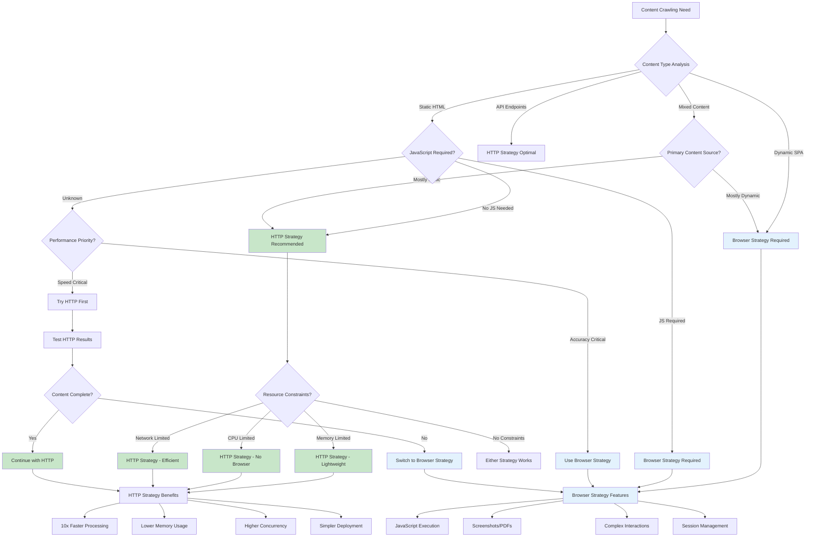
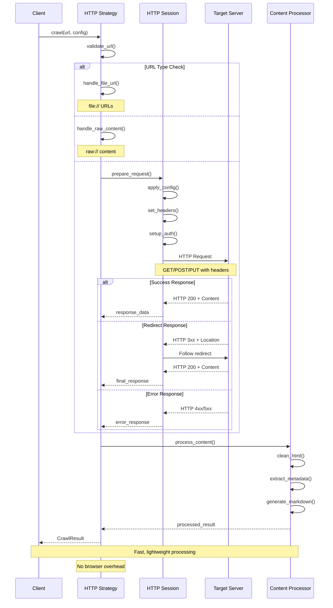
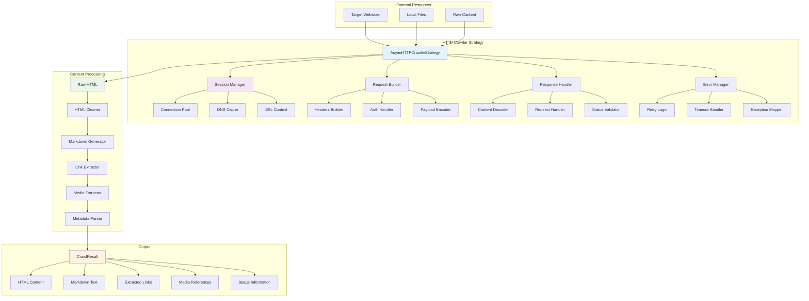
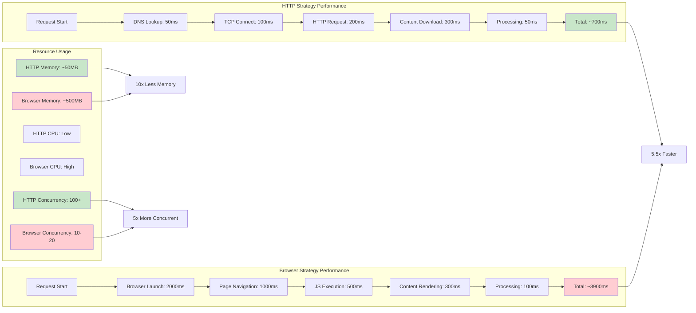
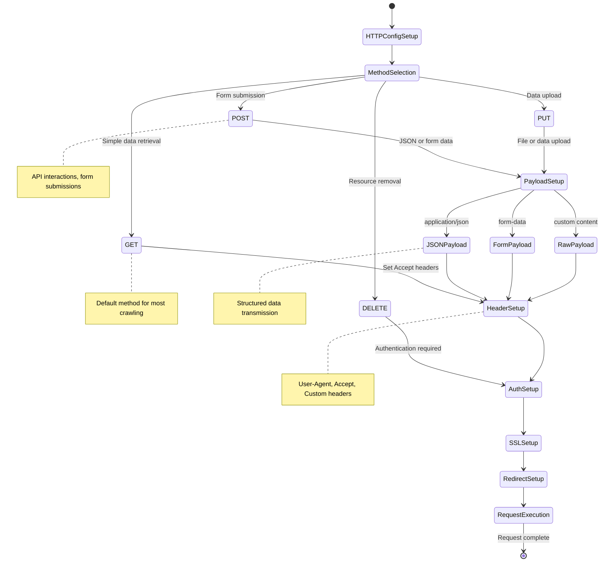
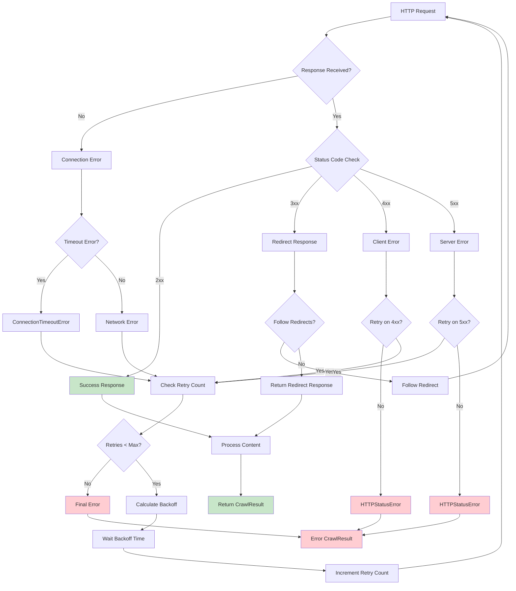
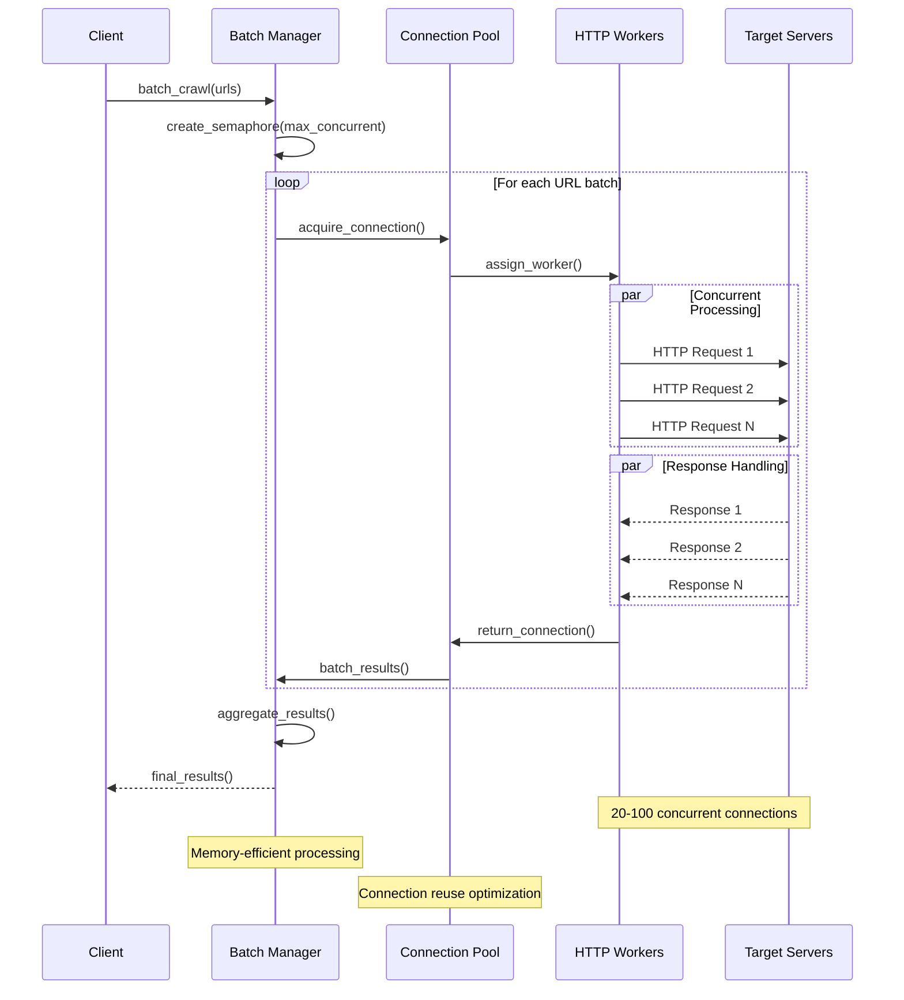
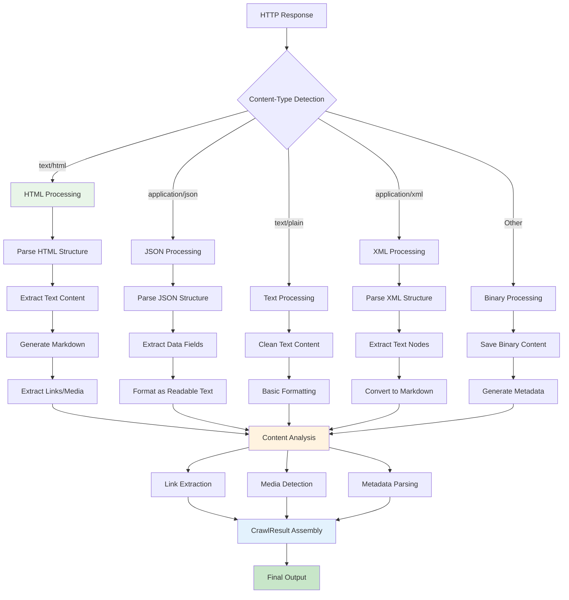
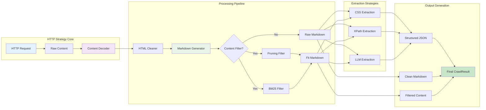

# Crawl4AI Custom LLM Context
Generated on: 2025-12-03T20:27:52.634Z
Total files: 2
Estimated tokens: 5,803

---

## HTTP-based Crawler - Full Content
Component ID: http_based_crawler_strategy
Context Type: memory
Estimated tokens: 2,390

## HTTP Crawler Strategy

Fast, lightweight HTTP-only crawling without browser overhead for cases where JavaScript execution isn't needed.

### Basic HTTP Crawler Setup

```python
import asyncio
from crawl4ai import AsyncWebCrawler, CrawlerRunConfig, HTTPCrawlerConfig, CacheMode
from crawl4ai.async_crawler_strategy import AsyncHTTPCrawlerStrategy
from crawl4ai.async_logger import AsyncLogger

async def main():
    # Initialize HTTP strategy
    http_strategy = AsyncHTTPCrawlerStrategy(
        browser_config=HTTPCrawlerConfig(
            method="GET",
            verify_ssl=True,
            follow_redirects=True
        ),
        logger=AsyncLogger(verbose=True)
    )

    # Use with AsyncWebCrawler
    async with AsyncWebCrawler(crawler_strategy=http_strategy) as crawler:
        result = await crawler.arun("https://example.com")
        print(f"Status: {result.status_code}")
        print(f"Content: {len(result.html)} chars")

if __name__ == "__main__":
    asyncio.run(main())
```

### HTTP Request Types

```python
# GET request (default)
http_config = HTTPCrawlerConfig(
    method="GET",
    headers={"Accept": "application/json"}
)

# POST with JSON data
http_config = HTTPCrawlerConfig(
    method="POST",
    json={"key": "value", "data": [1, 2, 3]},
    headers={"Content-Type": "application/json"}
)

# POST with form data
http_config = HTTPCrawlerConfig(
    method="POST",
    data={"username": "user", "password": "pass"},
    headers={"Content-Type": "application/x-www-form-urlencoded"}
)

# Advanced configuration
http_config = HTTPCrawlerConfig(
    method="GET",
    headers={"User-Agent": "Custom Bot/1.0"},
    follow_redirects=True,
    verify_ssl=False  # For testing environments
)

strategy = AsyncHTTPCrawlerStrategy(browser_config=http_config)
```

### File and Raw Content Handling

```python
async def test_content_types():
    strategy = AsyncHTTPCrawlerStrategy()
    
    # Web URLs
    result = await strategy.crawl("https://httpbin.org/get")
    print(f"Web content: {result.status_code}")
    
    # Local files
    result = await strategy.crawl("file:///path/to/local/file.html")
    print(f"File content: {len(result.html)}")
    
    # Raw HTML content
    raw_html = "raw://<html><body><h1>Test</h1><p>Content</p></body></html>"
    result = await strategy.crawl(raw_html)
    print(f"Raw content: {result.html}")
    
    # Raw content with complex HTML
    complex_html = """raw://<!DOCTYPE html>
    <html>
    <head><title>Test Page</title></head>
    <body>
        <div class="content">
            <h1>Main Title</h1>
            <p>Paragraph content</p>
            <ul><li>Item 1</li><li>Item 2</li></ul>
        </div>
    </body>
    </html>"""
    result = await strategy.crawl(complex_html)
```

### Custom Hooks and Request Handling

```python
async def setup_hooks():
    strategy = AsyncHTTPCrawlerStrategy()
    
    # Before request hook
    async def before_request(url, kwargs):
        print(f"Requesting: {url}")
        kwargs['headers']['X-Custom-Header'] = 'crawl4ai'
        kwargs['headers']['Authorization'] = 'Bearer token123'
    
    # After request hook
    async def after_request(response):
        print(f"Response: {response.status_code}")
        if hasattr(response, 'redirected_url'):
            print(f"Redirected to: {response.redirected_url}")
    
    # Error handling hook
    async def on_error(error):
        print(f"Request failed: {error}")
    
    # Set hooks
    strategy.set_hook('before_request', before_request)
    strategy.set_hook('after_request', after_request)
    strategy.set_hook('on_error', on_error)
    
    # Use with hooks
    result = await strategy.crawl("https://httpbin.org/headers")
    return result
```

### Performance Configuration

```python
# High-performance setup
strategy = AsyncHTTPCrawlerStrategy(
    max_connections=50,        # Concurrent connections
    dns_cache_ttl=300,        # DNS cache timeout
    chunk_size=128 * 1024     # 128KB chunks for large files
)

# Memory-efficient setup for large files
strategy = AsyncHTTPCrawlerStrategy(
    max_connections=10,
    chunk_size=32 * 1024,     # Smaller chunks
    dns_cache_ttl=600
)

# Custom timeout configuration
config = CrawlerRunConfig(
    page_timeout=30000,       # 30 second timeout
    cache_mode=CacheMode.BYPASS
)

result = await strategy.crawl("https://slow-server.com", config=config)
```

### Error Handling and Retries

```python
from crawl4ai.async_crawler_strategy import (
    ConnectionTimeoutError, 
    HTTPStatusError, 
    HTTPCrawlerError
)

async def robust_crawling():
    strategy = AsyncHTTPCrawlerStrategy()
    
    urls = [
        "https://example.com",
        "https://httpbin.org/status/404",
        "https://nonexistent.domain.test"
    ]
    
    for url in urls:
        try:
            result = await strategy.crawl(url)
            print(f"✓ {url}: {result.status_code}")
            
        except HTTPStatusError as e:
            print(f"✗ {url}: HTTP {e.status_code}")
            
        except ConnectionTimeoutError as e:
            print(f"✗ {url}: Timeout - {e}")
            
        except HTTPCrawlerError as e:
            print(f"✗ {url}: Crawler error - {e}")
            
        except Exception as e:
            print(f"✗ {url}: Unexpected error - {e}")

# Retry mechanism
async def crawl_with_retry(url, max_retries=3):
    strategy = AsyncHTTPCrawlerStrategy()
    
    for attempt in range(max_retries):
        try:
            return await strategy.crawl(url)
        except (ConnectionTimeoutError, HTTPCrawlerError) as e:
            if attempt == max_retries - 1:
                raise
            print(f"Retry {attempt + 1}/{max_retries}: {e}")
            await asyncio.sleep(2 ** attempt)  # Exponential backoff
```

### Batch Processing with HTTP Strategy

```python
async def batch_http_crawling():
    strategy = AsyncHTTPCrawlerStrategy(max_connections=20)
    
    urls = [
        "https://httpbin.org/get",
        "https://httpbin.org/user-agent",
        "https://httpbin.org/headers",
        "https://example.com",
        "https://httpbin.org/json"
    ]
    
    # Sequential processing
    results = []
    async with strategy:
        for url in urls:
            try:
                result = await strategy.crawl(url)
                results.append((url, result.status_code, len(result.html)))
            except Exception as e:
                results.append((url, "ERROR", str(e)))
    
    for url, status, content_info in results:
        print(f"{url}: {status} - {content_info}")

# Concurrent processing
async def concurrent_http_crawling():
    strategy = AsyncHTTPCrawlerStrategy()
    urls = ["https://httpbin.org/delay/1"] * 5
    
    async def crawl_single(url):
        try:
            result = await strategy.crawl(url)
            return f"✓ {result.status_code}"
        except Exception as e:
            return f"✗ {e}"
    
    async with strategy:
        tasks = [crawl_single(url) for url in urls]
        results = await asyncio.gather(*tasks, return_exceptions=True)
    
    for i, result in enumerate(results):
        print(f"URL {i+1}: {result}")
```

### Integration with Content Processing

```python
from crawl4ai import DefaultMarkdownGenerator, PruningContentFilter

async def http_with_processing():
    # HTTP strategy with content processing
    http_strategy = AsyncHTTPCrawlerStrategy(
        browser_config=HTTPCrawlerConfig(verify_ssl=True)
    )
    
    # Configure markdown generation
    crawler_config = CrawlerRunConfig(
        cache_mode=CacheMode.BYPASS,
        markdown_generator=DefaultMarkdownGenerator(
            content_filter=PruningContentFilter(
                threshold=0.48,
                threshold_type="fixed",
                min_word_threshold=10
            )
        ),
        word_count_threshold=5,
        excluded_tags=['script', 'style', 'nav'],
        exclude_external_links=True
    )
    
    async with AsyncWebCrawler(crawler_strategy=http_strategy) as crawler:
        result = await crawler.arun(
            url="https://example.com",
            config=crawler_config
        )
        
        print(f"Status: {result.status_code}")
        print(f"Raw HTML: {len(result.html)} chars")
        if result.markdown:
            print(f"Markdown: {len(result.markdown.raw_markdown)} chars")
            if result.markdown.fit_markdown:
                print(f"Filtered: {len(result.markdown.fit_markdown)} chars")
```

### HTTP vs Browser Strategy Comparison

```python
async def strategy_comparison():
    # Same URL with different strategies
    url = "https://example.com"
    
    # HTTP Strategy (fast, no JS)
    http_strategy = AsyncHTTPCrawlerStrategy()
    start_time = time.time()
    http_result = await http_strategy.crawl(url)
    http_time = time.time() - start_time
    
    # Browser Strategy (full features)
    from crawl4ai import BrowserConfig
    browser_config = BrowserConfig(headless=True)
    start_time = time.time()
    async with AsyncWebCrawler(config=browser_config) as crawler:
        browser_result = await crawler.arun(url)
    browser_time = time.time() - start_time
    
    print(f"HTTP Strategy:")
    print(f"  Time: {http_time:.2f}s")
    print(f"  Content: {len(http_result.html)} chars")
    print(f"  Features: Fast, lightweight, no JS")
    
    print(f"Browser Strategy:")
    print(f"  Time: {browser_time:.2f}s") 
    print(f"  Content: {len(browser_result.html)} chars")
    print(f"  Features: Full browser, JS, screenshots, etc.")
    
    # When to use HTTP strategy:
    # - Static content sites
    # - APIs returning HTML
    # - Fast bulk processing
    # - No JavaScript required
    # - Memory/resource constraints
    
    # When to use Browser strategy:
    # - Dynamic content (SPA, AJAX)
    # - JavaScript-heavy sites
    # - Screenshots/PDFs needed
    # - Complex interactions required
```

### Advanced Configuration

```python
# Custom session configuration
import aiohttp

async def advanced_http_setup():
    # Custom connector with specific settings
    connector = aiohttp.TCPConnector(
        limit=100,              # Connection pool size
        ttl_dns_cache=600,      # DNS cache TTL
        use_dns_cache=True,     # Enable DNS caching
        keepalive_timeout=30,   # Keep-alive timeout
        force_close=False       # Reuse connections
    )
    
    strategy = AsyncHTTPCrawlerStrategy(
        max_connections=50,
        dns_cache_ttl=600,
        chunk_size=64 * 1024
    )
    
    # Custom headers for all requests
    http_config = HTTPCrawlerConfig(
        headers={
            "User-Agent": "Crawl4AI-HTTP/1.0",
            "Accept": "text/html,application/xhtml+xml",
            "Accept-Language": "en-US,en;q=0.9",
            "Accept-Encoding": "gzip, deflate, br",
            "DNT": "1"
        },
        verify_ssl=True,
        follow_redirects=True
    )
    
    strategy.browser_config = http_config
    
    # Use with custom timeout
    config = CrawlerRunConfig(
        page_timeout=45000,  # 45 seconds
        cache_mode=CacheMode.ENABLED
    )
    
    result = await strategy.crawl("https://example.com", config=config)
    await strategy.close()
```

**📖 Learn more:** [AsyncWebCrawler API](https://docs.crawl4ai.com/api/async-webcrawler/), [Browser vs HTTP Strategy](https://docs.crawl4ai.com/core/browser-crawler-config/), [Performance Optimization](https://docs.crawl4ai.com/advanced/multi-url-crawling/)

---


## HTTP-based Crawler - Diagrams & Workflows
Component ID: http_based_crawler_strategy
Context Type: reasoning
Estimated tokens: 3,413

## HTTP Crawler Strategy Workflows

Visual representations of HTTP-based crawling architecture, request flows, and performance characteristics compared to browser-based strategies.

### HTTP vs Browser Strategy Decision Tree



### HTTP Request Lifecycle Sequence



### HTTP Strategy Architecture



### Performance Comparison Flow



### HTTP Request Types and Configuration



### Error Handling and Retry Workflow



### Batch Processing Architecture



### Content Type Processing Pipeline



### Integration with Processing Strategies



**📖 Learn more:** [HTTP vs Browser Strategies](https://docs.crawl4ai.com/core/browser-crawler-config/), [Performance Optimization](https://docs.crawl4ai.com/advanced/multi-url-crawling/), [Error Handling](https://docs.crawl4ai.com/api/async-webcrawler/)

---

