# Crawl4AI Custom LLM Context
Generated on: 2025-12-03T20:28:17.535Z
Total files: 2
Estimated tokens: 7,825

---

## URL Seeder - Full Content
Component ID: url_seeder
Context Type: memory
Estimated tokens: 4,745

## URL Seeding

Smart URL discovery for efficient large-scale crawling. Discover thousands of URLs instantly, filter by relevance, then crawl only what matters.

### Why URL Seeding vs Deep Crawling

```python
# Deep Crawling: Real-time discovery (page by page)
from crawl4ai import AsyncWebCrawler, CrawlerRunConfig
from crawl4ai.deep_crawling import BFSDeepCrawlStrategy

async def deep_crawl_example():
    config = CrawlerRunConfig(
        deep_crawl_strategy=BFSDeepCrawlStrategy(
            max_depth=2,
            include_external=False,
            max_pages=50
        )
    )
    
    async with AsyncWebCrawler() as crawler:
        results = await crawler.arun("https://example.com", config=config)
        print(f"Discovered {len(results)} pages dynamically")

# URL Seeding: Bulk discovery (thousands instantly)
from crawl4ai import AsyncUrlSeeder, SeedingConfig

async def url_seeding_example():
    config = SeedingConfig(
        source="sitemap+cc",
        pattern="*/docs/*",
        extract_head=True,
        query="API documentation",
        scoring_method="bm25",
        max_urls=1000
    )
    
    async with AsyncUrlSeeder() as seeder:
        urls = await seeder.urls("example.com", config)
        print(f"Discovered {len(urls)} URLs instantly")
        # Now crawl only the most relevant ones
```

### Basic URL Discovery

```python
import asyncio
from crawl4ai import AsyncUrlSeeder, SeedingConfig

async def basic_discovery():
    # Context manager handles cleanup automatically
    async with AsyncUrlSeeder() as seeder:
        
        # Simple discovery from sitemaps
        config = SeedingConfig(source="sitemap")
        urls = await seeder.urls("example.com", config)
        
        print(f"Found {len(urls)} URLs from sitemap")
        for url in urls[:5]:
            print(f"  - {url['url']} (status: {url['status']})")

# Manual cleanup (if needed)
async def manual_cleanup():
    seeder = AsyncUrlSeeder()
    try:
        config = SeedingConfig(source="cc")  # Common Crawl
        urls = await seeder.urls("example.com", config)
        print(f"Found {len(urls)} URLs from Common Crawl")
    finally:
        await seeder.close()

asyncio.run(basic_discovery())
```

### Data Sources and Patterns

```python
# Different data sources
configs = [
    SeedingConfig(source="sitemap"),        # Fastest, official URLs
    SeedingConfig(source="cc"),             # Most comprehensive
    SeedingConfig(source="sitemap+cc"),     # Maximum coverage
]

# URL pattern filtering
patterns = [
    SeedingConfig(pattern="*/blog/*"),           # Blog posts only
    SeedingConfig(pattern="*.html"),             # HTML files only
    SeedingConfig(pattern="*/product/*"),        # Product pages
    SeedingConfig(pattern="*/docs/api/*"),       # API documentation
    SeedingConfig(pattern="*"),                  # Everything
]

# Advanced pattern usage
async def pattern_filtering():
    async with AsyncUrlSeeder() as seeder:
        # Find all blog posts from 2024
        config = SeedingConfig(
            source="sitemap",
            pattern="*/blog/2024/*.html",
            max_urls=100
        )
        
        blog_urls = await seeder.urls("example.com", config)
        
        # Further filter by keywords in URL
        python_posts = [
            url for url in blog_urls 
            if "python" in url['url'].lower()
        ]
        
        print(f"Found {len(python_posts)} Python blog posts")
```

### SeedingConfig Parameters

```python
from crawl4ai import SeedingConfig

# Comprehensive configuration
config = SeedingConfig(
    # Data sources
    source="sitemap+cc",              # "sitemap", "cc", "sitemap+cc"
    pattern="*/docs/*",               # URL pattern filter
    
    # Metadata extraction
    extract_head=True,                # Get <head> metadata
    live_check=True,                  # Verify URLs are accessible
    
    # Performance controls
    max_urls=1000,                    # Limit results (-1 = unlimited)
    concurrency=20,                   # Parallel workers
    hits_per_sec=10,                  # Rate limiting
    
    # Relevance scoring
    query="API documentation guide",   # Search query
    scoring_method="bm25",            # Scoring algorithm
    score_threshold=0.3,              # Minimum relevance (0.0-1.0)
    
    # Cache and filtering
    force=False,                      # Bypass cache
    filter_nonsense_urls=True,        # Remove utility URLs
    verbose=True                      # Debug output
)

# Quick configurations for common use cases
blog_config = SeedingConfig(
    source="sitemap",
    pattern="*/blog/*", 
    extract_head=True
)

api_docs_config = SeedingConfig(
    source="sitemap+cc",
    pattern="*/docs/*",
    query="API reference documentation",
    scoring_method="bm25",
    score_threshold=0.5
)

product_pages_config = SeedingConfig(
    source="cc",
    pattern="*/product/*",
    live_check=True,
    max_urls=500
)
```

### Metadata Extraction and Analysis

```python
async def metadata_extraction():
    async with AsyncUrlSeeder() as seeder:
        config = SeedingConfig(
            source="sitemap",
            extract_head=True,        # Extract <head> metadata
            pattern="*/blog/*",
            max_urls=50
        )
        
        urls = await seeder.urls("example.com", config)
        
        # Analyze extracted metadata
        for url in urls[:5]:
            head_data = url['head_data']
            print(f"\nURL: {url['url']}")
            print(f"Title: {head_data.get('title', 'No title')}")
            
            # Standard meta tags
            meta = head_data.get('meta', {})
            print(f"Description: {meta.get('description', 'N/A')}")
            print(f"Keywords: {meta.get('keywords', 'N/A')}")
            print(f"Author: {meta.get('author', 'N/A')}")
            
            # Open Graph data
            print(f"OG Image: {meta.get('og:image', 'N/A')}")
            print(f"OG Type: {meta.get('og:type', 'N/A')}")
            
            # JSON-LD structured data
            jsonld = head_data.get('jsonld', [])
            if jsonld:
                print(f"Structured data: {len(jsonld)} items")
                for item in jsonld[:2]:
                    if isinstance(item, dict):
                        print(f"  Type: {item.get('@type', 'Unknown')}")
                        print(f"  Name: {item.get('name', 'N/A')}")

# Filter by metadata
async def metadata_filtering():
    async with AsyncUrlSeeder() as seeder:
        config = SeedingConfig(
            source="sitemap",
            extract_head=True,
            max_urls=100
        )
        
        urls = await seeder.urls("news.example.com", config)
        
        # Filter by publication date (from JSON-LD)
        from datetime import datetime, timedelta
        recent_cutoff = datetime.now() - timedelta(days=7)
        
        recent_articles = []
        for url in urls:
            for jsonld in url['head_data'].get('jsonld', []):
                if isinstance(jsonld, dict) and 'datePublished' in jsonld:
                    try:
                        pub_date = datetime.fromisoformat(
                            jsonld['datePublished'].replace('Z', '+00:00')
                        )
                        if pub_date > recent_cutoff:
                            recent_articles.append(url)
                            break
                    except:
                        continue
        
        print(f"Found {len(recent_articles)} recent articles")
```

### BM25 Relevance Scoring

```python
async def relevance_scoring():
    async with AsyncUrlSeeder() as seeder:
        # Find pages about Python async programming
        config = SeedingConfig(
            source="sitemap",
            extract_head=True,              # Required for content-based scoring
            query="python async await concurrency",
            scoring_method="bm25",
            score_threshold=0.3,            # Only 30%+ relevant pages
            max_urls=20
        )
        
        urls = await seeder.urls("docs.python.org", config)
        
        # Results are automatically sorted by relevance
        print("Most relevant Python async content:")
        for url in urls[:5]:
            score = url['relevance_score']
            title = url['head_data'].get('title', 'No title')
            print(f"[{score:.2f}] {title}")
            print(f"        {url['url']}")

# URL-based scoring (when extract_head=False)
async def url_based_scoring():
    async with AsyncUrlSeeder() as seeder:
        config = SeedingConfig(
            source="sitemap",
            extract_head=False,             # Fast URL-only scoring
            query="machine learning tutorial",
            scoring_method="bm25",
            score_threshold=0.2
        )
        
        urls = await seeder.urls("example.com", config)
        
        # Scoring based on URL structure, domain, path segments
        for url in urls[:5]:
            print(f"[{url['relevance_score']:.2f}] {url['url']}")

# Multi-concept queries
async def complex_queries():
    queries = [
        "data science pandas numpy visualization",
        "web scraping automation selenium",
        "machine learning tensorflow pytorch",
        "api documentation rest graphql"
    ]
    
    async with AsyncUrlSeeder() as seeder:
        all_results = []
        
        for query in queries:
            config = SeedingConfig(
                source="sitemap",
                extract_head=True,
                query=query,
                scoring_method="bm25",
                score_threshold=0.4,
                max_urls=10
            )
            
            urls = await seeder.urls("learning-site.com", config)
            all_results.extend(urls)
        
        # Remove duplicates while preserving order
        seen = set()
        unique_results = []
        for url in all_results:
            if url['url'] not in seen:
                seen.add(url['url'])
                unique_results.append(url)
        
        print(f"Found {len(unique_results)} unique pages across all topics")
```

### Live URL Validation

```python
async def url_validation():
    async with AsyncUrlSeeder() as seeder:
        config = SeedingConfig(
            source="sitemap",
            live_check=True,              # Verify URLs are accessible
            concurrency=15,               # Parallel HEAD requests
            hits_per_sec=8,              # Rate limiting
            max_urls=100
        )
        
        urls = await seeder.urls("example.com", config)
        
        # Analyze results
        valid_urls = [u for u in urls if u['status'] == 'valid']
        invalid_urls = [u for u in urls if u['status'] == 'not_valid']
        
        print(f"✅ Valid URLs: {len(valid_urls)}")
        print(f"❌ Invalid URLs: {len(invalid_urls)}")
        print(f"📊 Success rate: {len(valid_urls)/len(urls)*100:.1f}%")
        
        # Show some invalid URLs for debugging
        if invalid_urls:
            print("\nSample invalid URLs:")
            for url in invalid_urls[:3]:
                print(f"  - {url['url']}")

# Combined validation and metadata
async def comprehensive_validation():
    async with AsyncUrlSeeder() as seeder:
        config = SeedingConfig(
            source="sitemap",
            live_check=True,              # Verify accessibility
            extract_head=True,            # Get metadata
            query="tutorial guide",      # Relevance scoring
            scoring_method="bm25",
            score_threshold=0.2,
            concurrency=10,
            max_urls=50
        )
        
        urls = await seeder.urls("docs.example.com", config)
        
        # Filter for valid, relevant tutorials
        good_tutorials = [
            url for url in urls 
            if url['status'] == 'valid' and 
               url['relevance_score'] > 0.3 and
               'tutorial' in url['head_data'].get('title', '').lower()
        ]
        
        print(f"Found {len(good_tutorials)} high-quality tutorials")
```

### Multi-Domain Discovery

```python
async def multi_domain_research():
    async with AsyncUrlSeeder() as seeder:
        # Research Python tutorials across multiple sites
        domains = [
            "docs.python.org",
            "realpython.com",
            "python-course.eu",
            "tutorialspoint.com"
        ]
        
        config = SeedingConfig(
            source="sitemap",
            extract_head=True,
            query="python beginner tutorial basics",
            scoring_method="bm25",
            score_threshold=0.3,
            max_urls=15  # Per domain
        )
        
        # Discover across all domains in parallel
        results = await seeder.many_urls(domains, config)
        
        # Collect and rank all tutorials
        all_tutorials = []
        for domain, urls in results.items():
            for url in urls:
                url['domain'] = domain
                all_tutorials.append(url)
        
        # Sort by relevance across all domains
        all_tutorials.sort(key=lambda x: x['relevance_score'], reverse=True)
        
        print(f"Top 10 Python tutorials across {len(domains)} sites:")
        for i, tutorial in enumerate(all_tutorials[:10], 1):
            score = tutorial['relevance_score']
            title = tutorial['head_data'].get('title', 'No title')[:60]
            domain = tutorial['domain']
            print(f"{i:2d}. [{score:.2f}] {title}")
            print(f"     {domain}")

# Competitor analysis
async def competitor_analysis():
    competitors = ["competitor1.com", "competitor2.com", "competitor3.com"]
    
    async with AsyncUrlSeeder() as seeder:
        config = SeedingConfig(
            source="sitemap",
            extract_head=True,
            pattern="*/blog/*",
            max_urls=50
        )
        
        results = await seeder.many_urls(competitors, config)
        
        # Analyze content strategies
        for domain, urls in results.items():
            content_types = {}
            
            for url in urls:
                # Extract content type from metadata
                meta = url['head_data'].get('meta', {})
                og_type = meta.get('og:type', 'unknown')
                content_types[og_type] = content_types.get(og_type, 0) + 1
            
            print(f"\n{domain} content distribution:")
            for ctype, count in sorted(content_types.items(), 
                                     key=lambda x: x[1], reverse=True):
                print(f"  {ctype}: {count}")
```

### Complete Pipeline: Discovery → Filter → Crawl

```python
async def smart_research_pipeline():
    """Complete pipeline: discover URLs, filter by relevance, crawl top results"""
    
    async with AsyncUrlSeeder() as seeder:
        # Step 1: Discover relevant URLs
        print("🔍 Discovering URLs...")
        config = SeedingConfig(
            source="sitemap+cc",
            extract_head=True,
            query="machine learning deep learning tutorial",
            scoring_method="bm25",
            score_threshold=0.4,
            max_urls=100
        )
        
        urls = await seeder.urls("example.com", config)
        print(f"   Found {len(urls)} relevant URLs")
        
        # Step 2: Select top articles
        top_articles = sorted(urls, 
                            key=lambda x: x['relevance_score'], 
                            reverse=True)[:10]
        
        print(f"   Selected top {len(top_articles)} for crawling")
        
        # Step 3: Show what we're about to crawl
        print("\n📋 Articles to crawl:")
        for i, article in enumerate(top_articles, 1):
            score = article['relevance_score']
            title = article['head_data'].get('title', 'No title')[:60]
            print(f"  {i}. [{score:.2f}] {title}")
    
    # Step 4: Crawl selected articles
    from crawl4ai import AsyncWebCrawler, CrawlerRunConfig
    
    print(f"\n🕷️ Crawling {len(top_articles)} articles...")
    
    async with AsyncWebCrawler() as crawler:
        config = CrawlerRunConfig(
            only_text=True,
            word_count_threshold=200,
            stream=True  # Process results as they come
        )
        
        # Extract URLs and crawl
        article_urls = [article['url'] for article in top_articles]
        
        crawled_count = 0
        async for result in await crawler.arun_many(article_urls, config=config):
            if result.success:
                crawled_count += 1
                word_count = len(result.markdown.raw_markdown.split())
                print(f"   ✅ [{crawled_count}/{len(article_urls)}] "
                      f"{word_count} words from {result.url[:50]}...")
            else:
                print(f"   ❌ Failed: {result.url[:50]}...")
        
        print(f"\n✨ Successfully crawled {crawled_count} articles!")

asyncio.run(smart_research_pipeline())
```

### Advanced Features and Performance

```python
# Cache management
async def cache_management():
    async with AsyncUrlSeeder() as seeder:
        # First run - populate cache
        config = SeedingConfig(
            source="sitemap", 
            extract_head=True,
            force=True  # Bypass cache, fetch fresh
        )
        urls = await seeder.urls("example.com", config)
        
        # Subsequent runs - use cache (much faster)
        config = SeedingConfig(
            source="sitemap", 
            extract_head=True,
            force=False  # Use cache
        )
        urls = await seeder.urls("example.com", config)

# Performance optimization
async def performance_tuning():
    async with AsyncUrlSeeder() as seeder:
        # High-performance configuration
        config = SeedingConfig(
            source="cc",
            concurrency=50,        # Many parallel workers
            hits_per_sec=20,       # High rate limit
            max_urls=10000,        # Large dataset
            extract_head=False,    # Skip metadata for speed
            filter_nonsense_urls=True  # Auto-filter utility URLs
        )
        
        import time
        start = time.time()
        urls = await seeder.urls("large-site.com", config)
        elapsed = time.time() - start
        
        print(f"Processed {len(urls)} URLs in {elapsed:.2f}s")
        print(f"Speed: {len(urls)/elapsed:.0f} URLs/second")

# Memory-safe processing for large domains
async def large_domain_processing():
    async with AsyncUrlSeeder() as seeder:
        # Safe for domains with 1M+ URLs
        config = SeedingConfig(
            source="cc+sitemap",
            concurrency=50,        # Bounded queue adapts to this
            max_urls=100000,       # Process in batches
            filter_nonsense_urls=True
        )
        
        # The seeder automatically manages memory by:
        # - Using bounded queues (prevents RAM spikes)
        # - Applying backpressure when queue is full
        # - Processing URLs as they're discovered
        urls = await seeder.urls("huge-site.com", config)

# Configuration cloning and reuse
config_base = SeedingConfig(
    source="sitemap",
    extract_head=True,
    concurrency=20
)

# Create variations
blog_config = config_base.clone(pattern="*/blog/*")
docs_config = config_base.clone(
    pattern="*/docs/*",
    query="API documentation",
    scoring_method="bm25"
)
fast_config = config_base.clone(
    extract_head=False,
    concurrency=100,
    hits_per_sec=50
)
```

### Troubleshooting and Best Practices

```python
# Common issues and solutions
async def troubleshooting_guide():
    async with AsyncUrlSeeder() as seeder:
        # Issue: No URLs found
        try:
            config = SeedingConfig(source="sitemap", pattern="*/nonexistent/*")
            urls = await seeder.urls("example.com", config)
            if not urls:
                # Solution: Try broader pattern or different source
                config = SeedingConfig(source="cc+sitemap", pattern="*")
                urls = await seeder.urls("example.com", config)
        except Exception as e:
            print(f"Discovery failed: {e}")
        
        # Issue: Slow performance
        config = SeedingConfig(
            source="sitemap",  # Faster than CC
            concurrency=10,    # Reduce if hitting rate limits
            hits_per_sec=5,    # Add rate limiting
            extract_head=False # Skip if metadata not needed
        )
        
        # Issue: Low relevance scores
        config = SeedingConfig(
            query="specific detailed query terms",
            score_threshold=0.1,  # Lower threshold
            scoring_method="bm25"
        )
        
        # Issue: Memory issues with large sites
        config = SeedingConfig(
            max_urls=10000,       # Limit results
            concurrency=20,       # Reduce concurrency
            source="sitemap"      # Use sitemap only
        )

# Performance benchmarks
print("""
Typical performance on standard connection:
- Sitemap discovery: 100-1,000 URLs/second
- Common Crawl discovery: 50-500 URLs/second  
- HEAD checking: 10-50 URLs/second
- Head extraction: 5-20 URLs/second
- BM25 scoring: 10,000+ URLs/second
""")

# Best practices
best_practices = """
✅ Use context manager: async with AsyncUrlSeeder() as seeder
✅ Start with sitemaps (faster), add CC if needed
✅ Use extract_head=True only when you need metadata
✅ Set reasonable max_urls to limit processing
✅ Add rate limiting for respectful crawling
✅ Cache results with force=False for repeated operations
✅ Filter nonsense URLs (enabled by default)
✅ Use specific patterns to reduce irrelevant results
"""
```

**📖 Learn more:** [Complete URL Seeding Guide](https://docs.crawl4ai.com/core/url-seeding/), [SeedingConfig Reference](https://docs.crawl4ai.com/api/parameters/), [Multi-URL Crawling](https://docs.crawl4ai.com/advanced/multi-url-crawling/)

---


## URL Seeder - Diagrams & Workflows
Component ID: url_seeder
Context Type: reasoning
Estimated tokens: 3,080

## URL Seeding Workflows and Architecture

Visual representations of URL discovery strategies, filtering pipelines, and smart crawling workflows.

### URL Seeding vs Deep Crawling Strategy Comparison

```mermaid
graph TB
    subgraph "Deep Crawling Approach"
        A1[Start URL] --> A2[Load Page]
        A2 --> A3[Extract Links]
        A3 --> A4{More Links?}
        A4 -->|Yes| A5[Queue Next Page]
        A5 --> A2
        A4 -->|No| A6[Complete]
        
        A7[⏱️ Real-time Discovery]
        A8[🐌 Sequential Processing]
        A9[🔍 Limited by Page Structure]
        A10[💾 High Memory Usage]
    end
    
    subgraph "URL Seeding Approach"
        B1[Domain Input] --> B2[Query Sitemap]
        B1 --> B3[Query Common Crawl]
        B2 --> B4[Merge Results]
        B3 --> B4
        B4 --> B5[Apply Filters]
        B5 --> B6[Score Relevance]
        B6 --> B7[Rank Results]
        B7 --> B8[Select Top URLs]
        
        B9[⚡ Instant Discovery]
        B10[🚀 Parallel Processing]
        B11[🎯 Pattern-based Filtering]
        B12[💡 Smart Relevance Scoring]
    end
    
    style A1 fill:#ffecb3
    style B1 fill:#e8f5e8
    style A6 fill:#ffcdd2
    style B8 fill:#c8e6c9
```



### URL Discovery Data Flow


### SeedingConfig Decision Tree

```mermaid
flowchart TD
    A[SeedingConfig Setup] --> B{Data Source Strategy?}
    
    B -->|Fast & Official| C[source="sitemap"]
    B -->|Comprehensive| D[source="cc"]  
    B -->|Maximum Coverage| E[source="sitemap+cc"]
    
    C --> F{Need Filtering?}
    D --> F
    E --> F
    
    F -->|Yes| G[Set URL Pattern]
    F -->|No| H[pattern="*"]
    
    G --> I{Pattern Examples}
    I --> I1[pattern="*/blog/*"]
    I --> I2[pattern="*/docs/api/*"]
    I --> I3[pattern="*.pdf"]
    I --> I4[pattern="*/product/*"]
    
    H --> J{Need Metadata?}
    I1 --> J
    I2 --> J
    I3 --> J
    I4 --> J
    
    J -->|Yes| K[extract_head=True]
    J -->|No| L[extract_head=False]
    
    K --> M{Need Validation?}
    L --> M
    
    M -->|Yes| N[live_check=True]
    M -->|No| O[live_check=False]
    
    N --> P{Need Relevance Scoring?}
    O --> P
    
    P -->|Yes| Q[Set Query + BM25]
    P -->|No| R[Skip Scoring]
    
    Q --> S[query="search terms"]
    S --> T[scoring_method="bm25"]
    T --> U[score_threshold=0.3]
    
    R --> V[Performance Tuning]
    U --> V
    
    V --> W[Set max_urls]
    W --> X[Set concurrency]
    X --> Y[Set hits_per_sec]
    Y --> Z[Configuration Complete]
    
    style A fill:#e3f2fd
    style Z fill:#c8e6c9
    style K fill:#fff3e0
    style N fill:#fff3e0
    style Q fill:#f3e5f5
```

### BM25 Relevance Scoring Pipeline

```mermaid
graph TB
    subgraph "Text Corpus Preparation"
        A1[URL Collection] --> A2[Extract Metadata]
        A2 --> A3[Title + Description + Keywords]
        A3 --> A4[Tokenize Text]
        A4 --> A5[Remove Stop Words]
        A5 --> A6[Create Document Corpus]
    end
    
    subgraph "BM25 Algorithm"
        B1[Query Terms] --> B2[Term Frequency Calculation]
        A6 --> B2
        B2 --> B3[Inverse Document Frequency]
        B3 --> B4[BM25 Score Calculation]
        B4 --> B5[Score = Σ(IDF × TF × K1+1)/(TF + K1×(1-b+b×|d|/avgdl))]
    end
    
    subgraph "Scoring Results"
        B5 --> C1[URL Relevance Scores]
        C1 --> C2{Score ≥ Threshold?}
        C2 -->|Yes| C3[Include in Results]
        C2 -->|No| C4[Filter Out]
        C3 --> C5[Sort by Score DESC]
        C5 --> C6[Return Top URLs]
    end
    
    subgraph "Example Scores"
        D1["python async tutorial" → 0.85]
        D2["python documentation" → 0.72]
        D3["javascript guide" → 0.23]
        D4["contact us page" → 0.05]
    end
    
    style B5 fill:#e3f2fd
    style C6 fill:#c8e6c9
    style D1 fill:#c8e6c9
    style D2 fill:#c8e6c9
    style D3 fill:#ffecb3
    style D4 fill:#ffcdd2
```

### Multi-Domain Discovery Architecture


### Complete Discovery-to-Crawl Pipeline

```mermaid
stateDiagram-v2
    [*] --> Discovery
    
    Discovery --> SourceSelection: Configure data sources
    SourceSelection --> Sitemap: source="sitemap"
    SourceSelection --> CommonCrawl: source="cc"
    SourceSelection --> Both: source="sitemap+cc"
    
    Sitemap --> URLCollection
    CommonCrawl --> URLCollection
    Both --> URLCollection
    
    URLCollection --> Filtering: Apply patterns
    Filtering --> MetadataExtraction: extract_head=True
    Filtering --> LiveValidation: extract_head=False
    
    MetadataExtraction --> LiveValidation: live_check=True
    MetadataExtraction --> RelevanceScoring: live_check=False
    LiveValidation --> RelevanceScoring
    
    RelevanceScoring --> ResultRanking: query provided
    RelevanceScoring --> ResultLimiting: no query
    
    ResultRanking --> ResultLimiting: apply score_threshold
    ResultLimiting --> URLSelection: apply max_urls
    
    URLSelection --> CrawlPreparation: URLs ready
    CrawlPreparation --> CrawlExecution: AsyncWebCrawler
    
    CrawlExecution --> StreamProcessing: stream=True
    CrawlExecution --> BatchProcessing: stream=False
    
    StreamProcessing --> [*]
    BatchProcessing --> [*]
    
    note right of Discovery : 🔍 Smart URL Discovery
    note right of URLCollection : 📚 Merge & Deduplicate
    note right of RelevanceScoring : 🎯 BM25 Algorithm
    note right of CrawlExecution : 🕷️ High-Performance Crawling
```



### Performance Optimization Strategies


### URL Discovery vs Traditional Crawling Comparison

```mermaid
graph TB
    subgraph "Traditional Approach"
        T1[Start URL] --> T2[Crawl Page]
        T2 --> T3[Extract Links]
        T3 --> T4[Queue New URLs]
        T4 --> T2
        T5[❌ Time: Hours/Days]
        T6[❌ Resource Heavy]
        T7[❌ Depth Limited]
        T8[❌ Discovery Bias]
    end
    
    subgraph "URL Seeding Approach"
        S1[Domain Input] --> S2[Query All Sources]
        S2 --> S3[Pattern Filter]
        S3 --> S4[Relevance Score]
        S4 --> S5[Select Best URLs]
        S5 --> S6[Ready to Crawl]
        
        S7[✅ Time: Seconds/Minutes]
        S8[✅ Resource Efficient]
        S9[✅ Complete Coverage]
        S10[✅ Quality Focused]
    end
    
    subgraph "Use Case Decision Matrix"
        U1[Small Sites < 1000 pages] --> U2[Use Deep Crawling]
        U3[Large Sites > 10000 pages] --> U4[Use URL Seeding]
        U5[Unknown Structure] --> U6[Start with Seeding]
        U7[Real-time Discovery] --> U8[Use Deep Crawling]
        U9[Quality over Quantity] --> U10[Use URL Seeding]
    end
    
    style S6 fill:#c8e6c9
    style S7 fill:#c8e6c9
    style S8 fill:#c8e6c9
    style S9 fill:#c8e6c9
    style S10 fill:#c8e6c9
    style T5 fill:#ffcdd2
    style T6 fill:#ffcdd2
    style T7 fill:#ffcdd2
    style T8 fill:#ffcdd2
```



### Data Source Characteristics and Selection

```mermaid
graph TB
    subgraph "Sitemap Source"
        SM1[📋 Official URL List]
        SM2[⚡ Fast Response]
        SM3[📅 Recently Updated]
        SM4[🎯 High Quality URLs]
        SM5[❌ May Miss Some Pages]
    end
    
    subgraph "Common Crawl Source"
        CC1[🌐 Comprehensive Coverage]
        CC2[📚 Historical Data]
        CC3[🔍 Deep Discovery]
        CC4[⏳ Slower Response]
        CC5[🧹 May Include Noise]
    end
    
    subgraph "Combined Strategy"
        CB1[🚀 Best of Both]
        CB2[📊 Maximum Coverage]
        CB3[✨ Automatic Deduplication]
        CB4[⚖️ Balanced Performance]
    end
    
    subgraph "Selection Guidelines"
        G1[Speed Critical → Sitemap Only]
        G2[Coverage Critical → Common Crawl]
        G3[Best Quality → Combined]
        G4[Unknown Domain → Combined]
    end
    
    style SM2 fill:#c8e6c9
    style SM4 fill:#c8e6c9
    style CC1 fill:#e3f2fd
    style CC3 fill:#e3f2fd
    style CB1 fill:#f3e5f5
    style CB3 fill:#f3e5f5
```



**📖 Learn more:** [URL Seeding Guide](https://docs.crawl4ai.com/core/url-seeding/), [Performance Optimization](https://docs.crawl4ai.com/advanced/optimization/), [Multi-URL Crawling](https://docs.crawl4ai.com/advanced/multi-url-crawling/)

---

