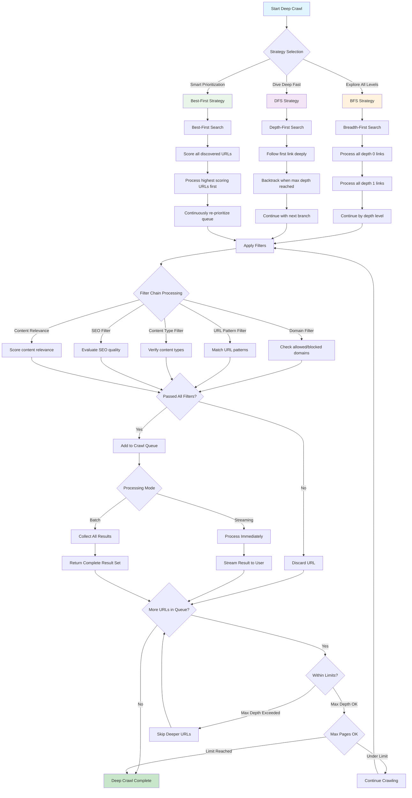
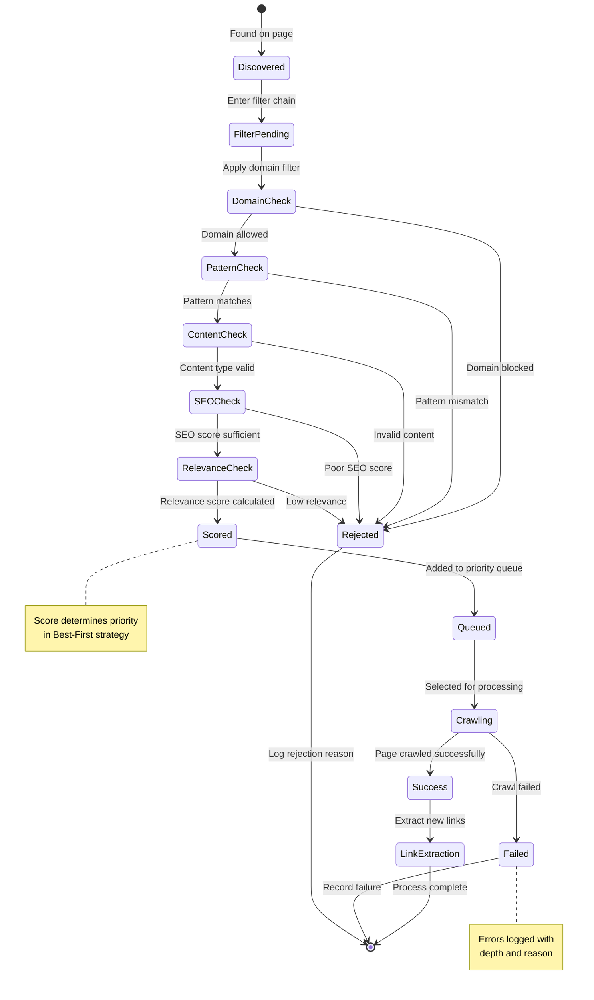
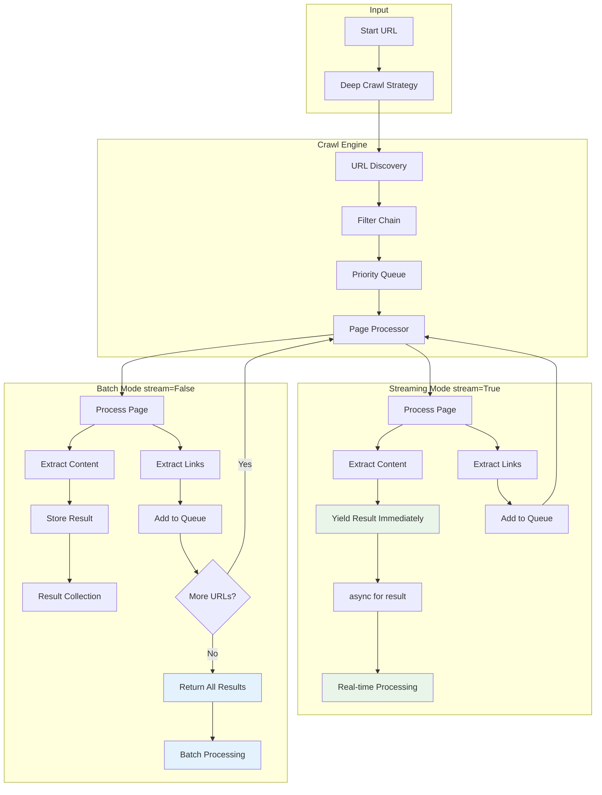
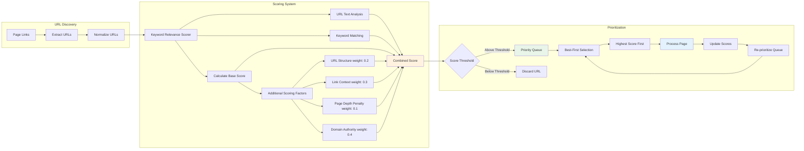
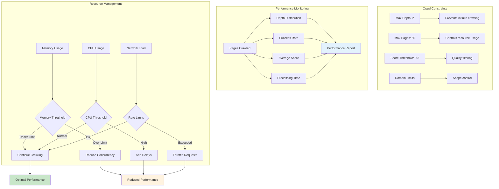
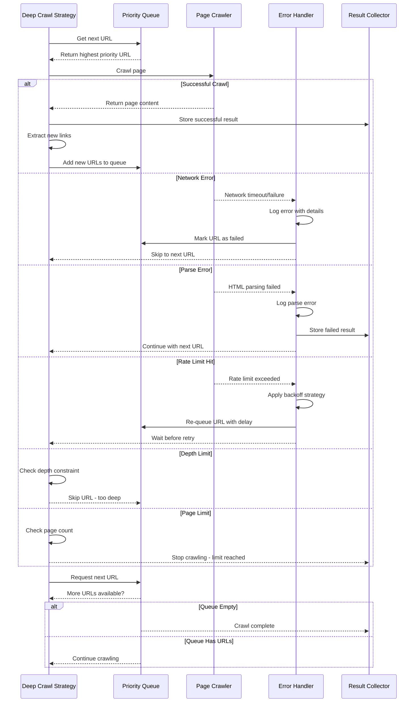

# Crawl4AI Custom LLM Context
Generated on: 2025-12-03T20:26:48.252Z
Total files: 2
Estimated tokens: 5,663

---

## Deep Crawling - Full Content
Component ID: deep_crawling
Context Type: memory
Estimated tokens: 2,208

## Deep Crawling

Multi-level website exploration with intelligent filtering, scoring, and prioritization strategies.

### Basic Deep Crawl Setup

```python
from crawl4ai import AsyncWebCrawler, CrawlerRunConfig
from crawl4ai.deep_crawling import BFSDeepCrawlStrategy
from crawl4ai.content_scraping_strategy import LXMLWebScrapingStrategy

# Basic breadth-first deep crawling
async def basic_deep_crawl():
    config = CrawlerRunConfig(
        deep_crawl_strategy=BFSDeepCrawlStrategy(
            max_depth=2,               # Initial page + 2 levels
            include_external=False     # Stay within same domain
        ),
        scraping_strategy=LXMLWebScrapingStrategy(),
        verbose=True
    )
    
    async with AsyncWebCrawler() as crawler:
        results = await crawler.arun("https://docs.crawl4ai.com", config=config)
        
        # Group results by depth
        pages_by_depth = {}
        for result in results:
            depth = result.metadata.get("depth", 0)
            if depth not in pages_by_depth:
                pages_by_depth[depth] = []
            pages_by_depth[depth].append(result.url)
        
        print(f"Crawled {len(results)} pages total")
        for depth, urls in sorted(pages_by_depth.items()):
            print(f"Depth {depth}: {len(urls)} pages")
```

### Deep Crawl Strategies

```python
from crawl4ai.deep_crawling import BFSDeepCrawlStrategy, DFSDeepCrawlStrategy, BestFirstCrawlingStrategy
from crawl4ai.deep_crawling.scorers import KeywordRelevanceScorer

# Breadth-First Search - explores all links at one depth before going deeper
bfs_strategy = BFSDeepCrawlStrategy(
    max_depth=2,
    include_external=False,
    max_pages=50,              # Limit total pages
    score_threshold=0.3        # Minimum score for URLs
)

# Depth-First Search - explores as deep as possible before backtracking
dfs_strategy = DFSDeepCrawlStrategy(
    max_depth=2,
    include_external=False,
    max_pages=30,
    score_threshold=0.5
)

# Best-First - prioritizes highest scoring pages (recommended)
keyword_scorer = KeywordRelevanceScorer(
    keywords=["crawl", "example", "async", "configuration"],
    weight=0.7
)

best_first_strategy = BestFirstCrawlingStrategy(
    max_depth=2,
    include_external=False,
    url_scorer=keyword_scorer,
    max_pages=25               # No score_threshold needed - naturally prioritizes
)

# Usage
config = CrawlerRunConfig(
    deep_crawl_strategy=best_first_strategy,  # Choose your strategy
    scraping_strategy=LXMLWebScrapingStrategy()
)
```

### Streaming vs Batch Processing

```python
# Batch mode - wait for all results
async def batch_deep_crawl():
    config = CrawlerRunConfig(
        deep_crawl_strategy=BFSDeepCrawlStrategy(max_depth=1),
        stream=False  # Default - collect all results first
    )
    
    async with AsyncWebCrawler() as crawler:
        results = await crawler.arun("https://example.com", config=config)
        
        # Process all results at once
        for result in results:
            print(f"Batch processed: {result.url}")

# Streaming mode - process results as they arrive
async def streaming_deep_crawl():
    config = CrawlerRunConfig(
        deep_crawl_strategy=BFSDeepCrawlStrategy(max_depth=1),
        stream=True  # Process results immediately
    )
    
    async with AsyncWebCrawler() as crawler:
        async for result in await crawler.arun("https://example.com", config=config):
            depth = result.metadata.get("depth", 0)
            print(f"Stream processed depth {depth}: {result.url}")
```

### Filtering with Filter Chains

```python
from crawl4ai.deep_crawling.filters import (
    FilterChain,
    URLPatternFilter,
    DomainFilter,
    ContentTypeFilter,
    SEOFilter,
    ContentRelevanceFilter
)

# Single URL pattern filter
url_filter = URLPatternFilter(patterns=["*core*", "*guide*"])

config = CrawlerRunConfig(
    deep_crawl_strategy=BFSDeepCrawlStrategy(
        max_depth=1,
        filter_chain=FilterChain([url_filter])
    )
)

# Multiple filters in chain
advanced_filter_chain = FilterChain([
    # Domain filtering
    DomainFilter(
        allowed_domains=["docs.example.com"],
        blocked_domains=["old.docs.example.com", "staging.example.com"]
    ),
    
    # URL pattern matching
    URLPatternFilter(patterns=["*tutorial*", "*guide*", "*blog*"]),
    
    # Content type filtering
    ContentTypeFilter(allowed_types=["text/html"]),
    
    # SEO quality filter
    SEOFilter(
        threshold=0.5,
        keywords=["tutorial", "guide", "documentation"]
    ),
    
    # Content relevance filter
    ContentRelevanceFilter(
        query="Web crawling and data extraction with Python",
        threshold=0.7
    )
])

config = CrawlerRunConfig(
    deep_crawl_strategy=BFSDeepCrawlStrategy(
        max_depth=2,
        filter_chain=advanced_filter_chain
    )
)
```

### Intelligent Crawling with Scorers

```python
from crawl4ai.deep_crawling.scorers import KeywordRelevanceScorer

# Keyword relevance scoring
async def scored_deep_crawl():
    keyword_scorer = KeywordRelevanceScorer(
        keywords=["browser", "crawler", "web", "automation"],
        weight=1.0
    )
    
    config = CrawlerRunConfig(
        deep_crawl_strategy=BestFirstCrawlingStrategy(
            max_depth=2,
            include_external=False,
            url_scorer=keyword_scorer
        ),
        stream=True,  # Recommended with BestFirst
        verbose=True
    )
    
    async with AsyncWebCrawler() as crawler:
        async for result in await crawler.arun("https://docs.crawl4ai.com", config=config):
            score = result.metadata.get("score", 0)
            depth = result.metadata.get("depth", 0)
            print(f"Depth: {depth} | Score: {score:.2f} | {result.url}")
```

### Limiting Crawl Size

```python
# Max pages limitation across strategies
async def limited_crawls():
    # BFS with page limit
    bfs_config = CrawlerRunConfig(
        deep_crawl_strategy=BFSDeepCrawlStrategy(
            max_depth=2,
            max_pages=5,  # Only crawl 5 pages total
            url_scorer=KeywordRelevanceScorer(keywords=["browser", "crawler"], weight=1.0)
        )
    )
    
    # DFS with score threshold
    dfs_config = CrawlerRunConfig(
        deep_crawl_strategy=DFSDeepCrawlStrategy(
            max_depth=2,
            score_threshold=0.7,  # Only URLs with scores above 0.7
            max_pages=10,
            url_scorer=KeywordRelevanceScorer(keywords=["web", "automation"], weight=1.0)
        )
    )
    
    # Best-First with both constraints
    bf_config = CrawlerRunConfig(
        deep_crawl_strategy=BestFirstCrawlingStrategy(
            max_depth=2,
            max_pages=7,  # Automatically gets highest scored pages
            url_scorer=KeywordRelevanceScorer(keywords=["crawl", "example"], weight=1.0)
        ),
        stream=True
    )
    
    async with AsyncWebCrawler() as crawler:
        # Use any of the configs
        async for result in await crawler.arun("https://docs.crawl4ai.com", config=bf_config):
            score = result.metadata.get("score", 0)
            print(f"Score: {score:.2f} | {result.url}")
```

### Complete Advanced Deep Crawler

```python
async def comprehensive_deep_crawl():
    # Sophisticated filter chain
    filter_chain = FilterChain([
        DomainFilter(
            allowed_domains=["docs.crawl4ai.com"],
            blocked_domains=["old.docs.crawl4ai.com"]
        ),
        URLPatternFilter(patterns=["*core*", "*advanced*", "*blog*"]),
        ContentTypeFilter(allowed_types=["text/html"]),
        SEOFilter(threshold=0.4, keywords=["crawl", "tutorial", "guide"])
    ])
    
    # Multi-keyword scorer
    keyword_scorer = KeywordRelevanceScorer(
        keywords=["crawl", "example", "async", "configuration", "browser"],
        weight=0.8
    )
    
    # Complete configuration
    config = CrawlerRunConfig(
        deep_crawl_strategy=BestFirstCrawlingStrategy(
            max_depth=2,
            include_external=False,
            filter_chain=filter_chain,
            url_scorer=keyword_scorer,
            max_pages=20
        ),
        scraping_strategy=LXMLWebScrapingStrategy(),
        stream=True,
        verbose=True,
        cache_mode=CacheMode.BYPASS
    )
    
    # Execute and analyze
    results = []
    start_time = time.time()
    
    async with AsyncWebCrawler() as crawler:
        async for result in await crawler.arun("https://docs.crawl4ai.com", config=config):
            results.append(result)
            score = result.metadata.get("score", 0)
            depth = result.metadata.get("depth", 0)
            print(f"→ Depth: {depth} | Score: {score:.2f} | {result.url}")
    
    # Performance analysis
    duration = time.time() - start_time
    avg_score = sum(r.metadata.get('score', 0) for r in results) / len(results)
    
    print(f"✅ Crawled {len(results)} pages in {duration:.2f}s")
    print(f"✅ Average relevance score: {avg_score:.2f}")
    
    # Depth distribution
    depth_counts = {}
    for result in results:
        depth = result.metadata.get("depth", 0)
        depth_counts[depth] = depth_counts.get(depth, 0) + 1
    
    for depth, count in sorted(depth_counts.items()):
        print(f"📊 Depth {depth}: {count} pages")
```

### Error Handling and Robustness

```python
async def robust_deep_crawl():
    config = CrawlerRunConfig(
        deep_crawl_strategy=BestFirstCrawlingStrategy(
            max_depth=2,
            max_pages=15,
            url_scorer=KeywordRelevanceScorer(keywords=["guide", "tutorial"])
        ),
        stream=True,
        page_timeout=30000  # 30 second timeout per page
    )
    
    successful_pages = []
    failed_pages = []
    
    async with AsyncWebCrawler() as crawler:
        async for result in await crawler.arun("https://docs.crawl4ai.com", config=config):
            if result.success:
                successful_pages.append(result)
                depth = result.metadata.get("depth", 0)
                score = result.metadata.get("score", 0)
                print(f"✅ Depth {depth} | Score: {score:.2f} | {result.url}")
            else:
                failed_pages.append({
                    'url': result.url,
                    'error': result.error_message,
                    'depth': result.metadata.get("depth", 0)
                })
                print(f"❌ Failed: {result.url} - {result.error_message}")
    
    print(f"📊 Results: {len(successful_pages)} successful, {len(failed_pages)} failed")
    
    # Analyze failures by depth
    if failed_pages:
        failure_by_depth = {}
        for failure in failed_pages:
            depth = failure['depth']
            failure_by_depth[depth] = failure_by_depth.get(depth, 0) + 1
        
        print("❌ Failures by depth:")
        for depth, count in sorted(failure_by_depth.items()):
            print(f"   Depth {depth}: {count} failures")
```

**📖 Learn more:** [Deep Crawling Guide](https://docs.crawl4ai.com/core/deep-crawling/), [Filter Documentation](https://docs.crawl4ai.com/core/content-selection/), [Scoring Strategies](https://docs.crawl4ai.com/advanced/advanced-features/)

---


## Deep Crawling - Diagrams & Workflows
Component ID: deep_crawling
Context Type: reasoning
Estimated tokens: 3,455

## Deep Crawling Workflows and Architecture

Visual representations of multi-level website exploration, filtering strategies, and intelligent crawling patterns.

### Deep Crawl Strategy Overview



### Deep Crawl Strategy Comparison

```mermaid
graph TB
    subgraph "BFS - Breadth-First Search"
        BFS1[Level 0: Start URL]
        BFS2[Level 1: All direct links]
        BFS3[Level 2: All second-level links]
        BFS4[Level 3: All third-level links]
        
        BFS1 --> BFS2
        BFS2 --> BFS3
        BFS3 --> BFS4
        
        BFS_NOTE[Complete each depth before going deeper<br/>Good for site mapping<br/>Memory intensive for wide sites]
    end
    
    subgraph "DFS - Depth-First Search"
        DFS1[Start URL]
        DFS2[First Link → Deep]
        DFS3[Follow until max depth]
        DFS4[Backtrack and try next]
        
        DFS1 --> DFS2
        DFS2 --> DFS3
        DFS3 --> DFS4
        DFS4 --> DFS2
        
        DFS_NOTE[Go deep on first path<br/>Memory efficient<br/>May miss important pages]
    end
    
    subgraph "Best-First - Priority Queue"
        BF1[Start URL]
        BF2[Score all discovered links]
        BF3[Process highest scoring first]
        BF4[Continuously re-prioritize]
        
        BF1 --> BF2
        BF2 --> BF3
        BF3 --> BF4
        BF4 --> BF2
        
        BF_NOTE[Intelligent prioritization<br/>Finds relevant content fast<br/>Recommended for most use cases]
    end
    
    style BFS1 fill:#e3f2fd
    style DFS1 fill:#f3e5f5
    style BF1 fill:#e8f5e8
    style BFS_NOTE fill:#fff3e0
    style DFS_NOTE fill:#fff3e0
    style BF_NOTE fill:#fff3e0
```



### Filter Chain Processing Sequence

```mermaid
sequenceDiagram
    participant URL as Discovered URL
    participant Chain as Filter Chain
    participant Domain as Domain Filter
    participant Pattern as URL Pattern Filter
    participant Content as Content Type Filter
    participant SEO as SEO Filter
    participant Relevance as Content Relevance Filter
    participant Queue as Crawl Queue
    
    URL->>Chain: Process URL
    Chain->>Domain: Check domain rules
    
    alt Domain Allowed
        Domain-->>Chain: ✓ Pass
        Chain->>Pattern: Check URL patterns
        
        alt Pattern Matches
            Pattern-->>Chain: ✓ Pass
            Chain->>Content: Check content type
            
            alt Content Type Valid
                Content-->>Chain: ✓ Pass
                Chain->>SEO: Evaluate SEO quality
                
                alt SEO Score Above Threshold
                    SEO-->>Chain: ✓ Pass
                    Chain->>Relevance: Score content relevance
                    
                    alt Relevance Score High
                        Relevance-->>Chain: ✓ Pass
                        Chain->>Queue: Add to crawl queue
                        Queue-->>URL: Queued for crawling
                    else Relevance Score Low
                        Relevance-->>Chain: ✗ Reject
                        Chain-->>URL: Filtered out - Low relevance
                    end
                else SEO Score Low
                    SEO-->>Chain: ✗ Reject
                    Chain-->>URL: Filtered out - Poor SEO
                end
            else Invalid Content Type
                Content-->>Chain: ✗ Reject
                Chain-->>URL: Filtered out - Wrong content type
            end
        else Pattern Mismatch
            Pattern-->>Chain: ✗ Reject
            Chain-->>URL: Filtered out - Pattern mismatch
        end
    else Domain Blocked
        Domain-->>Chain: ✗ Reject
        Chain-->>URL: Filtered out - Blocked domain
    end
```



### URL Lifecycle State Machine



### Streaming vs Batch Processing Architecture



### Advanced Scoring and Prioritization System



### Deep Crawl Performance and Limits



### Error Handling and Recovery Flow



**📖 Learn more:** [Deep Crawling Strategies](https://docs.crawl4ai.com/core/deep-crawling/), [Content Filtering](https://docs.crawl4ai.com/core/content-selection/), [Advanced Crawling Patterns](https://docs.crawl4ai.com/advanced/advanced-features/)

---

