# Crawl4AI Custom LLM Context
Generated on: 2025-12-03T20:17:27.578Z
Total files: 2
Estimated tokens: 4,116

---

## Installation - Full Content
Component ID: installation
Context Type: memory
Estimated tokens: 1,458

## Installation

Multiple installation options for different environments and use cases.

### Basic Installation

```bash
# Install core library
pip install crawl4ai

# Initial setup (installs Playwright browsers)
crawl4ai-setup

# Verify installation
crawl4ai-doctor
```

### Quick Verification

```python
import asyncio
from crawl4ai import AsyncWebCrawler

async def main():
    async with AsyncWebCrawler() as crawler:
        result = await crawler.arun("https://example.com")
        print(result.markdown[:300])

if __name__ == "__main__":
    asyncio.run(main())
```

**📖 Learn more:** [Basic Usage Guide](https://docs.crawl4ai.com/core/quickstart.md)

### Advanced Features (Optional)

```bash
# PyTorch-based features (text clustering, semantic chunking)
pip install crawl4ai[torch]
crawl4ai-setup

# Transformers (Hugging Face models)
pip install crawl4ai[transformer]
crawl4ai-setup

# All features (large download)
pip install crawl4ai[all]
crawl4ai-setup

# Pre-download models (optional)
crawl4ai-download-models
```

**📖 Learn more:** [Advanced Features Documentation](https://docs.crawl4ai.com/extraction/llm-strategies.md)

### Docker Deployment

```bash
# Pull pre-built image (specify platform for consistency)
docker pull --platform linux/amd64 unclecode/crawl4ai:latest
# For ARM (M1/M2 Macs): docker pull --platform linux/arm64 unclecode/crawl4ai:latest

# Setup environment for LLM support
cat > .llm.env << EOL
OPENAI_API_KEY=sk-your-key
ANTHROPIC_API_KEY=your-anthropic-key
EOL

# Run with LLM support (specify platform)
docker run -d \
  --platform linux/amd64 \
  -p 11235:11235 \
  --name crawl4ai \
  --env-file .llm.env \
  --shm-size=1g \
  unclecode/crawl4ai:latest

# For ARM Macs, use: --platform linux/arm64

# Basic run (no LLM)
docker run -d \
  --platform linux/amd64 \
  -p 11235:11235 \
  --name crawl4ai \
  --shm-size=1g \
  unclecode/crawl4ai:latest
```

**📖 Learn more:** [Complete Docker Guide](https://docs.crawl4ai.com/core/docker-deployment.md)

### Docker Compose

```bash
# Clone repository
git clone https://github.com/unclecode/crawl4ai.git
cd crawl4ai

# Copy environment template
cp deploy/docker/.llm.env.example .llm.env
# Edit .llm.env with your API keys

# Run pre-built image
IMAGE=unclecode/crawl4ai:latest docker compose up -d

# Build and run locally
docker compose up --build -d

# Build with all features
INSTALL_TYPE=all docker compose up --build -d

# Stop service
docker compose down
```

**📖 Learn more:** [Docker Compose Configuration](https://docs.crawl4ai.com/core/docker-deployment.md#option-2-using-docker-compose)

### Manual Docker Build

```bash
# Build multi-architecture image (specify platform)
docker buildx build --platform linux/amd64 -t crawl4ai-local:latest --load .
# For ARM: docker buildx build --platform linux/arm64 -t crawl4ai-local:latest --load .

# Build with specific features
docker buildx build \
  --platform linux/amd64 \
  --build-arg INSTALL_TYPE=all \
  --build-arg ENABLE_GPU=false \
  -t crawl4ai-local:latest --load .

# Run custom build (specify platform)
docker run -d \
  --platform linux/amd64 \
  -p 11235:11235 \
  --name crawl4ai-custom \
  --env-file .llm.env \
  --shm-size=1g \
  crawl4ai-local:latest
```

**📖 Learn more:** [Manual Build Guide](https://docs.crawl4ai.com/core/docker-deployment.md#option-3-manual-local-build--run)

### Google Colab

```python
# Install in Colab
!pip install crawl4ai
!crawl4ai-setup

# If setup fails, manually install Playwright browsers
!playwright install chromium

# Install with all features (may take 5-10 minutes)
!pip install crawl4ai[all]
!crawl4ai-setup
!crawl4ai-download-models

# If still having issues, force Playwright install
!playwright install chromium --force

# Quick test
import asyncio
from crawl4ai import AsyncWebCrawler

async def test_crawl():
    async with AsyncWebCrawler() as crawler:
        result = await crawler.arun("https://example.com")
        print("✅ Installation successful!")
        print(f"Content length: {len(result.markdown)}")

# Run test in Colab
await test_crawl()
```

**📖 Learn more:** [Colab Examples Notebook](https://colab.research.google.com/github/unclecode/crawl4ai/blob/main/docs/examples/quickstart.ipynb)

### Docker API Usage

```python
# Using Docker SDK
import asyncio
from crawl4ai.docker_client import Crawl4aiDockerClient
from crawl4ai import BrowserConfig, CrawlerRunConfig, CacheMode

async def main():
    async with Crawl4aiDockerClient(base_url="http://localhost:11235") as client:
        results = await client.crawl(
            ["https://example.com"],
            browser_config=BrowserConfig(headless=True),
            crawler_config=CrawlerRunConfig(cache_mode=CacheMode.BYPASS)
        )
        for result in results:
            print(f"Success: {result.success}, Length: {len(result.markdown)}")

asyncio.run(main())
```

**📖 Learn more:** [Docker Client API](https://docs.crawl4ai.com/core/docker-deployment.md#python-sdk)

### Direct API Calls

```python
# REST API example
import requests

payload = {
    "urls": ["https://example.com"],
    "browser_config": {"type": "BrowserConfig", "params": {"headless": True}},
    "crawler_config": {"type": "CrawlerRunConfig", "params": {"cache_mode": "bypass"}}
}

response = requests.post("http://localhost:11235/crawl", json=payload)
print(response.json())
```

**📖 Learn more:** [REST API Reference](https://docs.crawl4ai.com/core/docker-deployment.md#rest-api-examples)

### Health Check

```bash
# Check Docker service
curl http://localhost:11235/health

# Access playground
open http://localhost:11235/playground

# View metrics
curl http://localhost:11235/metrics
```

**📖 Learn more:** [Monitoring & Metrics](https://docs.crawl4ai.com/core/docker-deployment.md#metrics--monitoring)

---


## Installation - Diagrams & Workflows
Component ID: installation
Context Type: reasoning
Estimated tokens: 2,658

## Installation Workflows and Architecture

Visual representations of Crawl4AI installation processes, deployment options, and system interactions.

### Installation Decision Flow


### Basic Installation Sequence


### Docker Deployment Architecture

```mermaid
graph TB
    subgraph "Host System"
        A[Docker Engine] --> B[Crawl4AI Container]
        C[.llm.env File] --> B
        D[Port 11235] --> B
    end
    
    subgraph "Container Environment"
        B --> E[FastAPI Server]
        B --> F[Playwright Browsers]
        B --> G[Python Runtime]
        
        E --> H[/crawl Endpoint]
        E --> I[/playground Interface]
        E --> J[/health Monitoring]
        E --> K[/metrics Prometheus]
        
        F --> L[Chromium Browser]
        F --> M[Firefox Browser]
        F --> N[WebKit Browser]
    end
    
    subgraph "External Services"
        O[OpenAI API] --> B
        P[Anthropic API] --> B
        Q[Local LLM Ollama] --> B
    end
    
    subgraph "Client Applications"
        R[Python SDK] --> H
        S[REST API Calls] --> H
        T[Web Browser] --> I
        U[Monitoring Tools] --> J
        V[Prometheus] --> K
    end
    
    style B fill:#e3f2fd
    style E fill:#f3e5f5
    style F fill:#e8f5e8
    style G fill:#fff3e0
```

### Advanced Features Installation Flow


### Platform-Specific Installation Matrix


### Docker Multi-Stage Build Process


### Installation Verification Workflow

```mermaid
flowchart TD
    A[Installation Complete] --> B[Run crawl4ai-doctor]
    
    B --> C{Python Version Check}
    C -->|✓ 3.10+| D{Playwright Check}
    C -->|✗ < 3.10| C1[Upgrade Python]
    C1 --> D
    
    D -->|✓ Installed| E{Browser Binaries}
    D -->|✗ Missing| D1[Run crawl4ai-setup]
    D1 --> E
    
    E -->|✓ Available| F{Test Browser Launch}
    E -->|✗ Missing| E1[playwright install]
    E1 --> F
    
    F -->|✓ Success| G[Test Basic Crawl]
    F -->|✗ Failed| F1[Check system dependencies]
    F1 --> F
    
    G --> H{Crawl Test Result}
    H -->|✓ Success| I[Installation Verified ✓]
    H -->|✗ Failed| H1[Check network/permissions]
    H1 --> G
    
    I --> J[Ready for Production Use]
    
    style I fill:#c8e6c9
    style J fill:#e8f5e8
    style C1 fill:#ffcdd2
    style D1 fill:#fff3e0
    style E1 fill:#fff3e0
    style F1 fill:#ffcdd2
    style H1 fill:#ffcdd2
```



### Resource Requirements by Installation Type


**📖 Learn more:** [Installation Guide](https://docs.crawl4ai.com/core/installation/), [Docker Deployment](https://docs.crawl4ai.com/core/docker-deployment/), [System Requirements](https://docs.crawl4ai.com/core/installation/#prerequisites)

---

