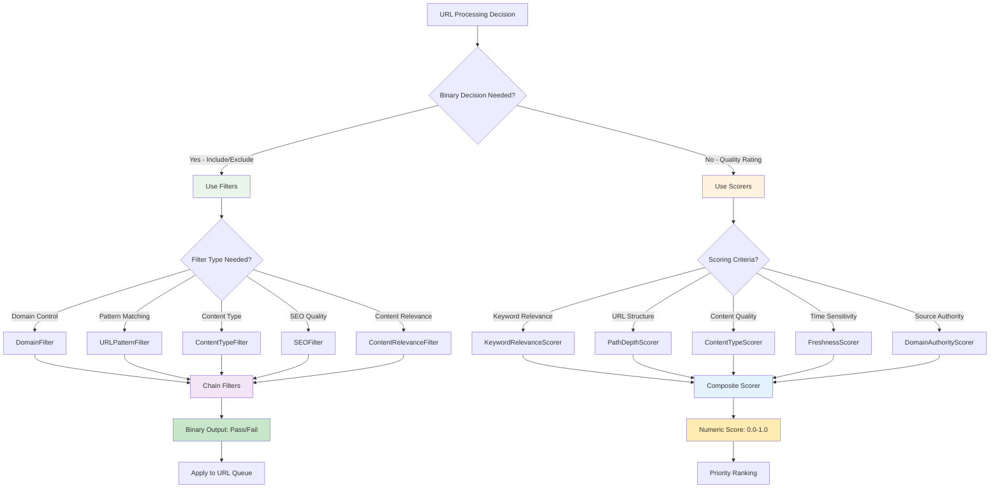
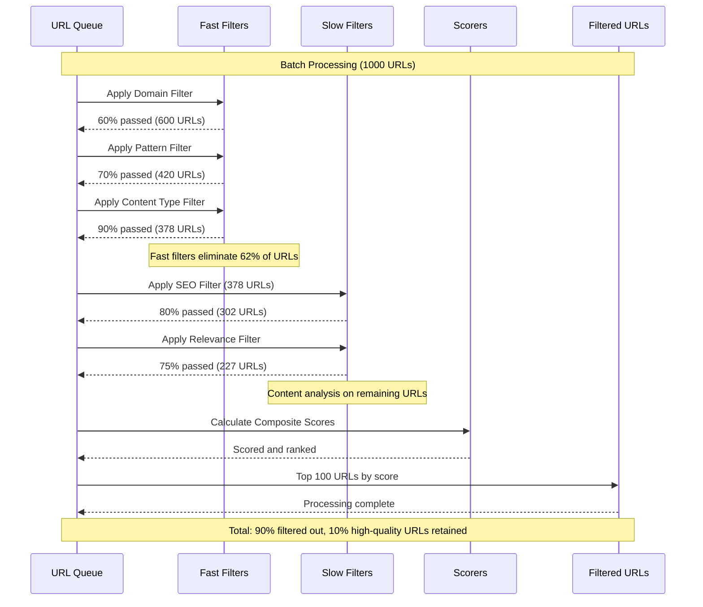
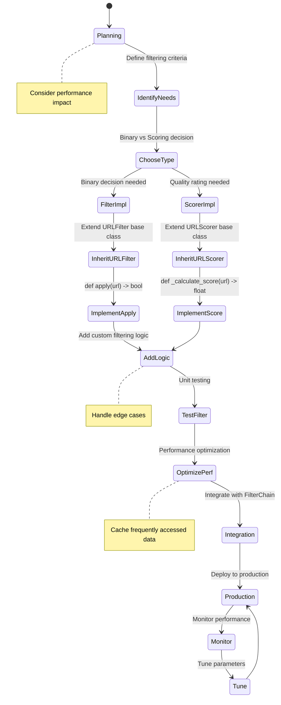
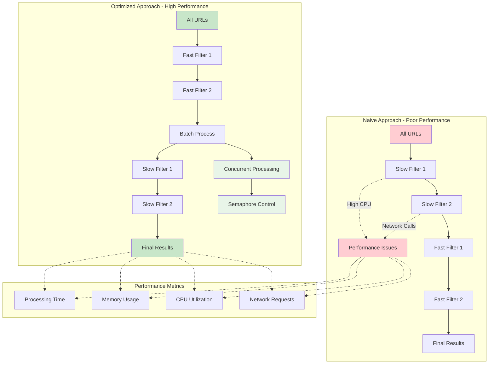
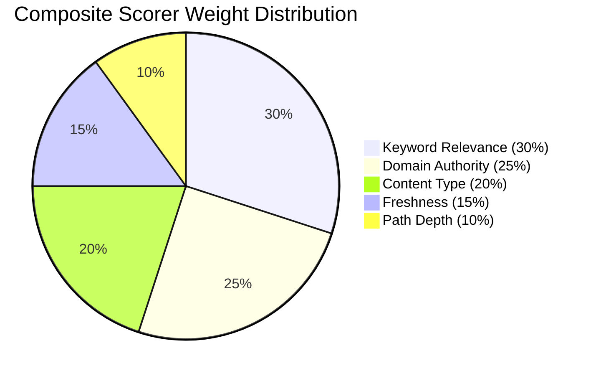
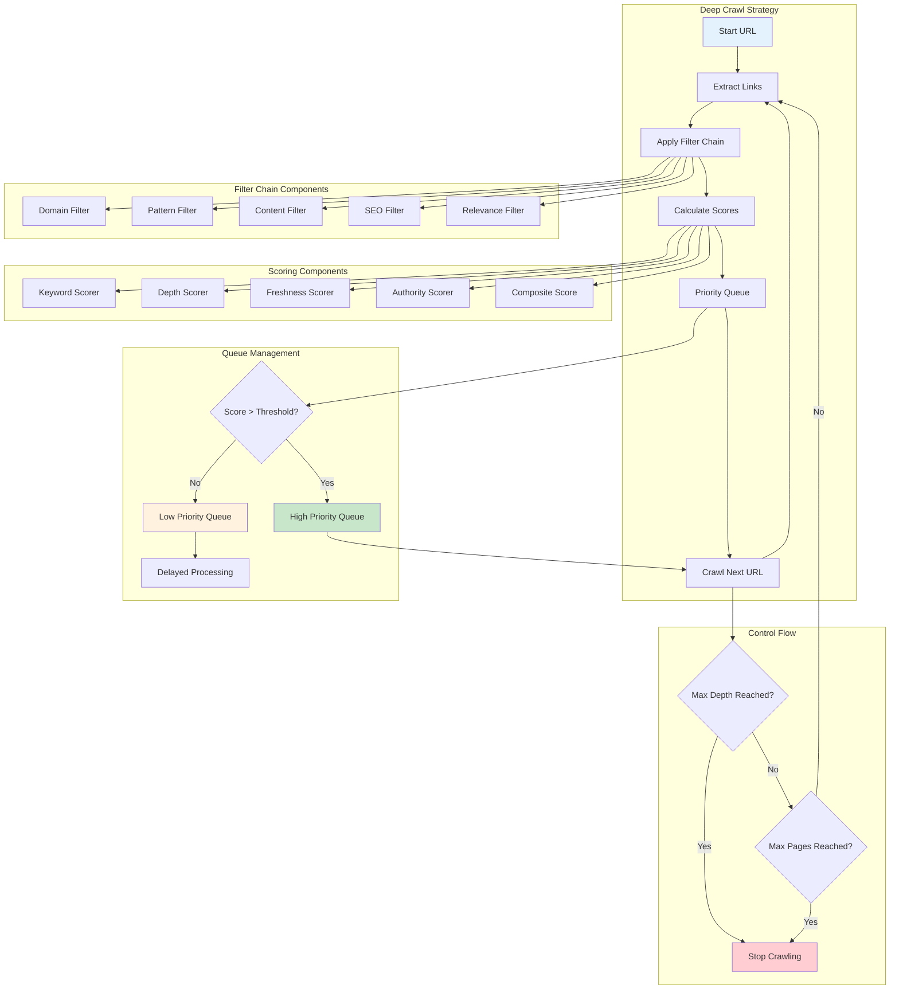
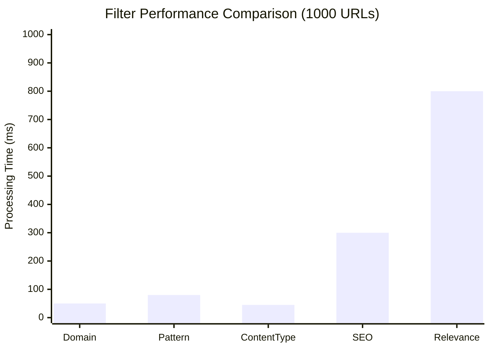
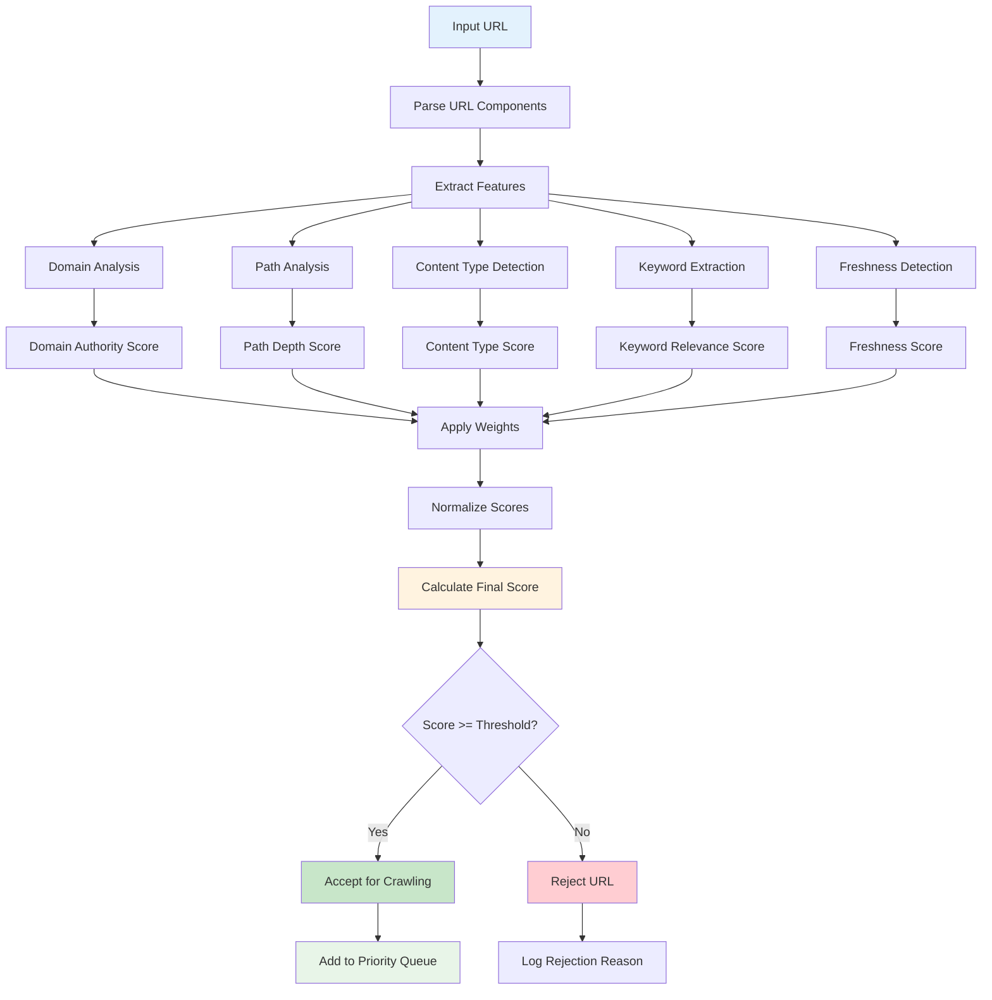

# Crawl4AI Custom LLM Context
Generated on: 2025-12-03T20:28:42.271Z
Total files: 2
Estimated tokens: 5,743

---

## Advanced Filters & Scorers - Full Content
Component ID: deep_crawl_advanced_filters_scorers
Context Type: memory
Estimated tokens: 2,713

## Deep Crawling Filters & Scorers

Advanced URL filtering and scoring strategies for intelligent deep crawling with performance optimization.

### URL Filters - Content and Domain Control

```python
from crawl4ai.deep_crawling.filters import (
    URLPatternFilter, DomainFilter, ContentTypeFilter, 
    FilterChain, ContentRelevanceFilter, SEOFilter
)

# Pattern-based filtering
pattern_filter = URLPatternFilter(
    patterns=[
        "*.html",           # HTML pages only
        "*/blog/*",         # Blog posts
        "*/articles/*",     # Article pages
        "*2024*",          # Recent content
        "^https://example.com/docs/.*"  # Regex pattern
    ],
    use_glob=True,
    reverse=False  # False = include matching, True = exclude matching
)

# Domain filtering with subdomains
domain_filter = DomainFilter(
    allowed_domains=["example.com", "docs.example.com"],
    blocked_domains=["ads.example.com", "tracker.com"]
)

# Content type filtering
content_filter = ContentTypeFilter(
    allowed_types=["text/html", "application/pdf"],
    check_extension=True
)

# Apply individual filters
url = "https://example.com/blog/2024/article.html"
print(f"Pattern filter: {pattern_filter.apply(url)}")
print(f"Domain filter: {domain_filter.apply(url)}")
print(f"Content filter: {content_filter.apply(url)}")
```

### Filter Chaining - Combine Multiple Filters

```python
# Create filter chain for comprehensive filtering
filter_chain = FilterChain([
    DomainFilter(allowed_domains=["example.com"]),
    URLPatternFilter(patterns=["*/blog/*", "*/docs/*"]),
    ContentTypeFilter(allowed_types=["text/html"])
])

# Apply chain to URLs
urls = [
    "https://example.com/blog/post1.html",
    "https://spam.com/content.html",
    "https://example.com/blog/image.jpg",
    "https://example.com/docs/guide.html"
]

async def filter_urls(urls, filter_chain):
    filtered = []
    for url in urls:
        if await filter_chain.apply(url):
            filtered.append(url)
    return filtered

# Usage
filtered_urls = await filter_urls(urls, filter_chain)
print(f"Filtered URLs: {filtered_urls}")

# Check filter statistics
for filter_obj in filter_chain.filters:
    stats = filter_obj.stats
    print(f"{filter_obj.name}: {stats.passed_urls}/{stats.total_urls} passed")
```

### Advanced Content Filters

```python
# BM25-based content relevance filtering
relevance_filter = ContentRelevanceFilter(
    query="python machine learning tutorial",
    threshold=0.5,  # Minimum relevance score
    k1=1.2,        # TF saturation parameter
    b=0.75,        # Length normalization
    avgdl=1000     # Average document length
)

# SEO quality filtering
seo_filter = SEOFilter(
    threshold=0.65,  # Minimum SEO score
    keywords=["python", "tutorial", "guide"],
    weights={
        "title_length": 0.15,
        "title_kw": 0.18,
        "meta_description": 0.12,
        "canonical": 0.10,
        "robot_ok": 0.20,
        "schema_org": 0.10,
        "url_quality": 0.15
    }
)

# Apply advanced filters
url = "https://example.com/python-ml-tutorial"
relevance_score = await relevance_filter.apply(url)
seo_score = await seo_filter.apply(url)

print(f"Relevance: {relevance_score}, SEO: {seo_score}")
```

### URL Scorers - Quality and Relevance Scoring

```python
from crawl4ai.deep_crawling.scorers import (
    KeywordRelevanceScorer, PathDepthScorer, ContentTypeScorer,
    FreshnessScorer, DomainAuthorityScorer, CompositeScorer
)

# Keyword relevance scoring
keyword_scorer = KeywordRelevanceScorer(
    keywords=["python", "tutorial", "guide", "machine", "learning"],
    weight=1.0,
    case_sensitive=False
)

# Path depth scoring (optimal depth = 3)
depth_scorer = PathDepthScorer(
    optimal_depth=3,  # /category/subcategory/article
    weight=0.8
)

# Content type scoring
content_type_scorer = ContentTypeScorer(
    type_weights={
        "html": 1.0,    # Highest priority
        "pdf": 0.8,     # Medium priority
        "txt": 0.6,     # Lower priority
        "doc": 0.4      # Lowest priority
    },
    weight=0.9
)

# Freshness scoring
freshness_scorer = FreshnessScorer(
    weight=0.7,
    current_year=2024
)

# Domain authority scoring
domain_scorer = DomainAuthorityScorer(
    domain_weights={
        "python.org": 1.0,
        "github.com": 0.9,
        "stackoverflow.com": 0.85,
        "medium.com": 0.7,
        "personal-blog.com": 0.3
    },
    default_weight=0.5,
    weight=1.0
)

# Score individual URLs
url = "https://python.org/tutorial/2024/machine-learning.html"
scores = {
    "keyword": keyword_scorer.score(url),
    "depth": depth_scorer.score(url),
    "content": content_type_scorer.score(url),
    "freshness": freshness_scorer.score(url),
    "domain": domain_scorer.score(url)
}

print(f"Individual scores: {scores}")
```

### Composite Scoring - Combine Multiple Scorers

```python
# Create composite scorer combining all strategies
composite_scorer = CompositeScorer(
    scorers=[
        KeywordRelevanceScorer(["python", "tutorial"], weight=1.5),
        PathDepthScorer(optimal_depth=3, weight=1.0),
        ContentTypeScorer({"html": 1.0, "pdf": 0.8}, weight=1.2),
        FreshnessScorer(weight=0.8, current_year=2024),
        DomainAuthorityScorer({
            "python.org": 1.0,
            "github.com": 0.9
        }, weight=1.3)
    ],
    normalize=True  # Normalize by number of scorers
)

# Score multiple URLs
urls_to_score = [
    "https://python.org/tutorial/2024/basics.html",
    "https://github.com/user/python-guide/blob/main/README.md",
    "https://random-blog.com/old/2018/python-stuff.html",
    "https://python.org/docs/deep/nested/advanced/guide.html"
]

scored_urls = []
for url in urls_to_score:
    score = composite_scorer.score(url)
    scored_urls.append((url, score))

# Sort by score (highest first)
scored_urls.sort(key=lambda x: x[1], reverse=True)

for url, score in scored_urls:
    print(f"Score: {score:.3f} - {url}")

# Check scorer statistics
print(f"\nScoring statistics:")
print(f"URLs scored: {composite_scorer.stats._urls_scored}")
print(f"Average score: {composite_scorer.stats.get_average():.3f}")
```

### Advanced Filter Patterns

```python
# Complex pattern matching
advanced_patterns = URLPatternFilter(
    patterns=[
        r"^https://docs\.python\.org/\d+/",  # Python docs with version
        r".*/tutorial/.*\.html$",             # Tutorial pages
        r".*/guide/(?!deprecated).*",         # Guides but not deprecated
        "*/blog/{2020,2021,2022,2023,2024}/*", # Recent blog posts
        "**/{api,reference}/**/*.html"        # API/reference docs
    ],
    use_glob=True
)

# Exclude patterns (reverse=True)
exclude_filter = URLPatternFilter(
    patterns=[
        "*/admin/*",
        "*/login/*", 
        "*/private/*",
        "**/.*",          # Hidden files
        "*.{jpg,png,gif,css,js}$"  # Media and assets
    ],
    reverse=True  # Exclude matching patterns
)

# Content type with extension mapping
detailed_content_filter = ContentTypeFilter(
    allowed_types=["text", "application"],
    check_extension=True,
    ext_map={
        "html": "text/html",
        "htm": "text/html", 
        "md": "text/markdown",
        "pdf": "application/pdf",
        "doc": "application/msword",
        "docx": "application/vnd.openxmlformats-officedocument.wordprocessingml.document"
    }
)
```

### Performance-Optimized Filtering

```python
# High-performance filter chain for large-scale crawling
class OptimizedFilterChain:
    def __init__(self):
        # Fast filters first (domain, patterns)
        self.fast_filters = [
            DomainFilter(
                allowed_domains=["example.com", "docs.example.com"],
                blocked_domains=["ads.example.com"]
            ),
            URLPatternFilter([
                "*.html", "*.pdf", "*/blog/*", "*/docs/*"
            ])
        ]
        
        # Slower filters last (content analysis)
        self.slow_filters = [
            ContentRelevanceFilter(
                query="important content",
                threshold=0.3
            )
        ]
    
    async def apply_optimized(self, url: str) -> bool:
        # Apply fast filters first
        for filter_obj in self.fast_filters:
            if not filter_obj.apply(url):
                return False
        
        # Only apply slow filters if fast filters pass
        for filter_obj in self.slow_filters:
            if not await filter_obj.apply(url):
                return False
        
        return True

# Batch filtering with concurrency
async def batch_filter_urls(urls, filter_chain, max_concurrent=50):
    import asyncio
    semaphore = asyncio.Semaphore(max_concurrent)
    
    async def filter_single(url):
        async with semaphore:
            return await filter_chain.apply(url), url
    
    tasks = [filter_single(url) for url in urls]
    results = await asyncio.gather(*tasks)
    
    return [url for passed, url in results if passed]

# Usage with 1000 URLs
large_url_list = [f"https://example.com/page{i}.html" for i in range(1000)]
optimized_chain = OptimizedFilterChain()
filtered = await batch_filter_urls(large_url_list, optimized_chain)
```

### Custom Filter Implementation

```python
from crawl4ai.deep_crawling.filters import URLFilter
import re

class CustomLanguageFilter(URLFilter):
    """Filter URLs by language indicators"""
    
    def __init__(self, allowed_languages=["en"], weight=1.0):
        super().__init__()
        self.allowed_languages = set(allowed_languages)
        self.lang_patterns = {
            "en": re.compile(r"/en/|/english/|lang=en"),
            "es": re.compile(r"/es/|/spanish/|lang=es"),
            "fr": re.compile(r"/fr/|/french/|lang=fr"),
            "de": re.compile(r"/de/|/german/|lang=de")
        }
    
    def apply(self, url: str) -> bool:
        # Default to English if no language indicators
        if not any(pattern.search(url) for pattern in self.lang_patterns.values()):
            result = "en" in self.allowed_languages
            self._update_stats(result)
            return result
        
        # Check for allowed languages
        for lang in self.allowed_languages:
            if lang in self.lang_patterns:
                if self.lang_patterns[lang].search(url):
                    self._update_stats(True)
                    return True
        
        self._update_stats(False)
        return False

# Custom scorer implementation
from crawl4ai.deep_crawling.scorers import URLScorer

class CustomComplexityScorer(URLScorer):
    """Score URLs by content complexity indicators"""
    
    def __init__(self, weight=1.0):
        super().__init__(weight)
        self.complexity_indicators = {
            "tutorial": 0.9,
            "guide": 0.8, 
            "example": 0.7,
            "reference": 0.6,
            "api": 0.5
        }
    
    def _calculate_score(self, url: str) -> float:
        url_lower = url.lower()
        max_score = 0.0
        
        for indicator, score in self.complexity_indicators.items():
            if indicator in url_lower:
                max_score = max(max_score, score)
        
        return max_score

# Use custom filters and scorers
custom_filter = CustomLanguageFilter(allowed_languages=["en", "es"])
custom_scorer = CustomComplexityScorer(weight=1.2)

url = "https://example.com/en/tutorial/advanced-guide.html"
passes_filter = custom_filter.apply(url)
complexity_score = custom_scorer.score(url)

print(f"Passes language filter: {passes_filter}")
print(f"Complexity score: {complexity_score}")
```

### Integration with Deep Crawling

```python
from crawl4ai import AsyncWebCrawler, CrawlerRunConfig
from crawl4ai.deep_crawling import DeepCrawlStrategy

async def deep_crawl_with_filtering():
    # Create comprehensive filter chain
    filter_chain = FilterChain([
        DomainFilter(allowed_domains=["python.org"]),
        URLPatternFilter(["*/tutorial/*", "*/guide/*", "*/docs/*"]),
        ContentTypeFilter(["text/html"]),
        SEOFilter(threshold=0.6, keywords=["python", "programming"])
    ])
    
    # Create composite scorer
    scorer = CompositeScorer([
        KeywordRelevanceScorer(["python", "tutorial"], weight=1.5),
        FreshnessScorer(weight=0.8),
        PathDepthScorer(optimal_depth=3, weight=1.0)
    ], normalize=True)
    
    # Configure deep crawl strategy with filters and scorers
    deep_strategy = DeepCrawlStrategy(
        max_depth=3,
        max_pages=100,
        url_filter=filter_chain,
        url_scorer=scorer,
        score_threshold=0.6  # Only crawl URLs scoring above 0.6
    )
    
    config = CrawlerRunConfig(
        deep_crawl_strategy=deep_strategy,
        cache_mode=CacheMode.BYPASS
    )
    
    async with AsyncWebCrawler() as crawler:
        result = await crawler.arun(
            url="https://python.org",
            config=config
        )
        
        print(f"Deep crawl completed: {result.success}")
        if hasattr(result, 'deep_crawl_results'):
            print(f"Pages crawled: {len(result.deep_crawl_results)}")

# Run the deep crawl
await deep_crawl_with_filtering()
```

**📖 Learn more:** [Deep Crawling Strategy](https://docs.crawl4ai.com/core/deep-crawling/), [Custom Filter Development](https://docs.crawl4ai.com/advanced/custom-filters/), [Performance Optimization](https://docs.crawl4ai.com/advanced/performance-tuning/)

---


## Advanced Filters & Scorers - Diagrams & Workflows
Component ID: deep_crawl_advanced_filters_scorers
Context Type: reasoning
Estimated tokens: 3,030

## Deep Crawling Filters & Scorers Architecture

Visual representations of advanced URL filtering, scoring strategies, and performance optimization workflows for intelligent deep crawling.

### Filter Chain Processing Pipeline

```mermaid
flowchart TD
    A[URL Input] --> B{Domain Filter}
    B -->|✓ Pass| C{Pattern Filter}
    B -->|✗ Fail| X1[Reject: Invalid Domain]
    
    C -->|✓ Pass| D{Content Type Filter}
    C -->|✗ Fail| X2[Reject: Pattern Mismatch]
    
    D -->|✓ Pass| E{SEO Filter}
    D -->|✗ Fail| X3[Reject: Wrong Content Type]
    
    E -->|✓ Pass| F{Content Relevance Filter}
    E -->|✗ Fail| X4[Reject: Low SEO Score]
    
    F -->|✓ Pass| G[URL Accepted]
    F -->|✗ Fail| X5[Reject: Low Relevance]
    
    G --> H[Add to Crawl Queue]
    
    subgraph "Fast Filters"
        B
        C
        D
    end
    
    subgraph "Slow Filters"
        E
        F
    end
    
    style A fill:#e3f2fd
    style G fill:#c8e6c9
    style H fill:#e8f5e8
    style X1 fill:#ffcdd2
    style X2 fill:#ffcdd2
    style X3 fill:#ffcdd2
    style X4 fill:#ffcdd2
    style X5 fill:#ffcdd2
```



### URL Scoring System Architecture

```mermaid
graph TB
    subgraph "Input URL"
        A[https://python.org/tutorial/2024/ml-guide.html]
    end
    
    subgraph "Individual Scorers"
        B[Keyword Relevance Scorer]
        C[Path Depth Scorer]
        D[Content Type Scorer]
        E[Freshness Scorer]
        F[Domain Authority Scorer]
    end
    
    subgraph "Scoring Process"
        B --> B1[Keywords: python, tutorial, ml<br/>Score: 0.85]
        C --> C1[Depth: 4 levels<br/>Optimal: 3<br/>Score: 0.75]
        D --> D1[Content: HTML<br/>Score: 1.0]
        E --> E1[Year: 2024<br/>Score: 1.0]
        F --> F1[Domain: python.org<br/>Score: 1.0]
    end
    
    subgraph "Composite Scoring"
        G[Weighted Combination]
        B1 --> G
        C1 --> G
        D1 --> G
        E1 --> G
        F1 --> G
    end
    
    subgraph "Final Result"
        H[Composite Score: 0.92]
        I{Score > Threshold?}
        J[Accept URL]
        K[Reject URL]
    end
    
    A --> B
    A --> C
    A --> D
    A --> E
    A --> F
    
    G --> H
    H --> I
    I -->|✓ 0.92 > 0.6| J
    I -->|✗ Score too low| K
    
    style A fill:#e3f2fd
    style G fill:#fff3e0
    style H fill:#e8f5e8
    style J fill:#c8e6c9
    style K fill:#ffcdd2
```



### Filter vs Scorer Decision Matrix



### Performance Optimization Strategy



### Custom Filter Implementation Flow



### Filter Chain Optimization Patterns



### Composite Scoring Weight Distribution



### Deep Crawl Integration Architecture



### Filter Performance Comparison



### Scoring Algorithm Workflow



**📖 Learn more:** [Deep Crawling Strategy](https://docs.crawl4ai.com/core/deep-crawling/), [Performance Optimization](https://docs.crawl4ai.com/advanced/performance-tuning/), [Custom Implementations](https://docs.crawl4ai.com/advanced/custom-filters/)

---

